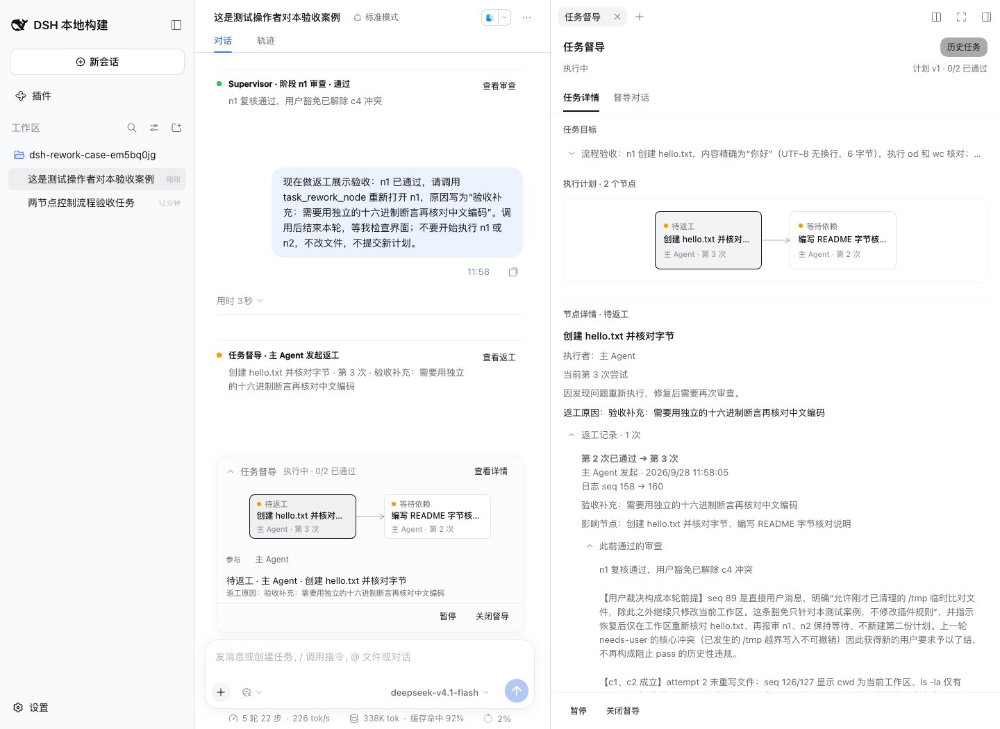
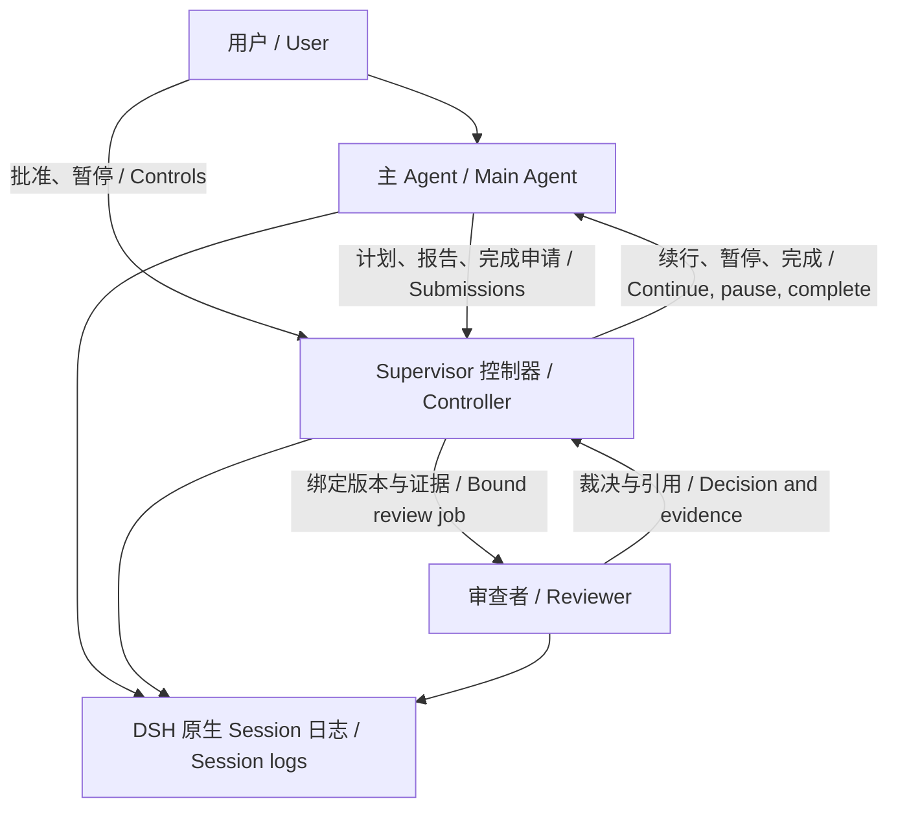
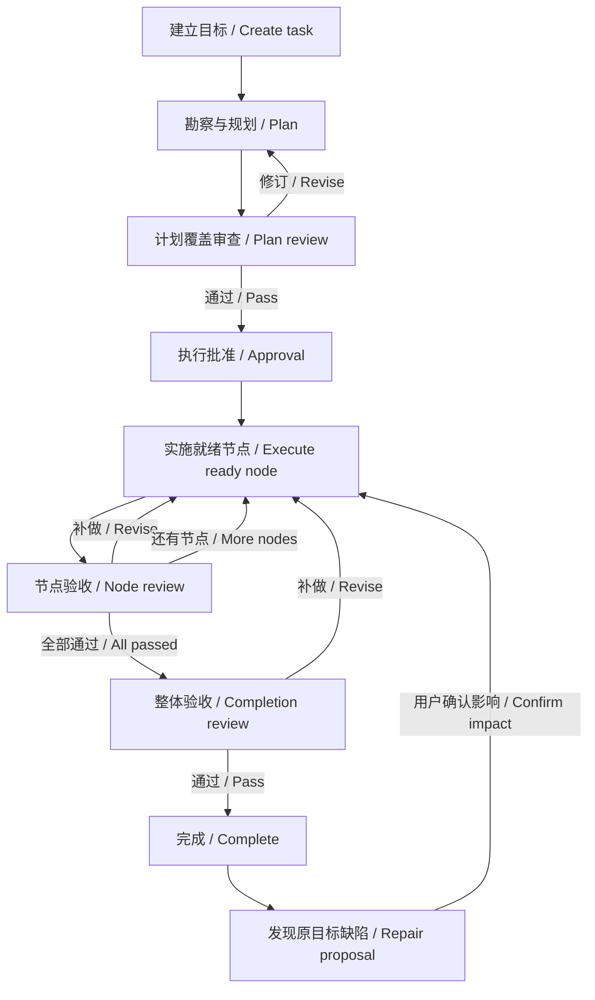

# DSH Task Supervisor

English | [中文](README.zh.md)

[npm](https://www.npmjs.com/package/dsh-task-supervisor) · [Report an issue](https://github.com/gosomea/dsh-task-supervisor/issues) · [Community](https://github.com/deepseek-ai/deepseek-harness/discussions/8892)

## Summary

Use `/task` to track, pause and rework a goal, follow its DAG, and obtain reviews during planning, execution and completion. The main Agent plans and delivers; Supervisor persists state, schedules reviews, and continues, pauses or closes the task under valid decisions. Discuss requirements, ask about progress and explicitly change tasks in consultation. Default review examines the main conversation log; direct artifact reads and isolated checks require configuration, and passing review does not guarantee that nothing was missed.

## Table of Contents

- [Get started](#get-started)
- [Architecture and responsibilities](#architecture-and-responsibilities)
- [The complete Task lifecycle](#the-complete-task-lifecycle)
- [When reviewers intervene and what they check](#when-reviewers-intervene-and-what-they-check)
- [Evidence and independent verification](#evidence-and-independent-verification)
- [Continuation, pause and recovery](#continuation-pause-and-recovery)
- [Understand the implementation and develop](#understand-the-implementation-and-develop)
- [Further Exploration](#further-exploration)
- [Model Experience](#model-experience)
- [Known Limitations and Deferred Work](#known-limitations-and-deferred-work)

-----

<a id="get-started"></a>
## Get started

This page describes **0.1.4**, which creates Tasks in native DSH modes. Complete reports are separate from tool process details; requirement outcomes, Task/attempt evidence scope and bounded read correction are described in [review experience](docs/review-experience.md). Earlier native-process and recovery changes are in [the 0.1.3 release](docs/releases/0.1.3.md). Earlier versions and public Host boundaries are documented in [the 0.1.2 release](docs/releases/0.1.2.md), [public DSH installation validation](docs/native-install.md) and [supervised tasks in native modes](docs/native-task.md).

### Install into a Web profile

Node 24 and official DSH `0.2.0-rc.2` are validated without Host or native sandbox modifications. Retain the profile's model configuration and install the public package:

```sh
dsh plugin --profile web add dsh-task-supervisor@0.1.4
dsh web
```

To test current source, build and pack it with the development commands below, then use `dsh plugin --profile web add /absolute/path/to/package.tgz` in an isolated profile. The package includes Host and Web plugins plus an optional check gateway; DSH provides its native components.

### Create and approve a task

Enter `/task <objective>` in the main conversation to begin planning. Bare `/task` waits for the next message as the objective; with an unfinished task it shows status without resuming execution. `/task new <objective>` remains a compatibility alias. The main Agent can also use the task tool for an explicit natural-language creation request.

After plan review passes, execution normally waits for `/task approve`, a qualifying approval reply in the main conversation, or the sidebar approval button. Explicitly authorize execution after review to automate that approval. Approval permits implementation; node and whole-task acceptance still apply.

The main conversation shows a compact DAG, participating Agents, progress and short review notices. A node or details link opens the full sidebar: conversation handles consultation and requirements; details holds plans, nodes, reviews and controls. The more menu provides read-only task history.



*An earlier isolated validation example retaining the reason and dependency impact of a passed node entering a new rework attempt.*

-----

<a id="architecture-and-responsibilities"></a>
## Architecture and responsibilities

Supervisor contains a deterministic controller and model reviewers. The controller owns task state and continuation authority; reviewers make evidence-based decisions. Consultation is a user-facing Session, separate from automatic checkpoint review.



| Actor or component | Responsibility | Authority and limits |
| --- | --- | --- |
| User | Supplies objectives, constraints, approval and necessary decisions. | Initial execution defaults to manual approval; every post-completion reopening needs an impact-confirmation click. |
| Main Agent | Investigates, proposes plans, implements, integrates, reports and requests completion. | Can propose completion but cannot mark the Task accepted itself. |
| Supervisor controller | Persists tasks and DAGs, admits turns, starts reviews, applies valid decisions, stops and restores owned work. | Checks identity, versions, permission and evidence validity before transitions; model prose alone grants no authority. |
| Checkpoint reviewer | Checks original requirements and evidence within the job, returning pass, revise or needs-user. | Normally a fresh native Session per checkpoint; supplementation or recovery retains the job identity and never implements in the main workspace. |
| Delegated Worker, optional | Implements ready DAG nodes within exact assigned file paths. | The main Agent integrates and rechecks; a Worker report does not accept its node. |
| Consultation | Refines objectives, proposes drafts, explains progress and forwards explicit controls. | Ordinary questions do not pause execution; the same controller validates control requests. |
| DSH Sessions and projections | Retain human messages, execution and control records, review links and rebuildable views. | Native logs are authoritative; projections do not create a second history requiring manual synchronization. |

Current source retains the main Session's native preset and Goal/Plan tools. While a Task exists, Supervisor disarms native Goal continuation through public GoalService; native Plan/Todo can organize work but cannot approve or accept the Task. Supervisor does not act as a general Team Lead; the main Agent and Workers implement.

-----

<a id="the-complete-task-lifecycle"></a>
## The complete Task lifecycle

A task can span many model turns. Reviews in this diagram are formal checkpoints handed to the controller after submission; planning and execution also receive activity observations under the next section's conditions.



1. **Establish requirements.** Create a task directly, or refine a broad idea into a consultation draft first. The controller binds the main Session, task ID and requirements version. Original human requirements remain the acceptance authority.
2. **Investigate and form a plan.** The main Agent uses native tools to inspect inputs and the workspace, then proposes criteria and a DAG. Planning retains native permissions and asks for investigation before implementation approval; it does not prohibit every read or `run_code`. Supervisor can inspect planning progress for unknown conditions, repetition or stalled investigation.
3. **Submit the plan.** `task_submit_plan` persists the job, proposal, requirements version, evidence cutoff and reviewer Session identity, promptly returns submitted, and ends the turn. After tool activity settles, the controller runs coverage review. Revision findings return to the main Agent; a pass enters initial execution approval.
4. **Admit implementation.** Wait for user approval by default; explicit preauthorization permits automatic execution only after review passes. Independent mode checks declared capabilities and toolchains first. Requirements edits revoke prior approval and preauthorization and return to planning. Later plan revisions under unchanged requirements still need review without unconditionally repeating initial approval.
5. **Execute DAG nodes.** Predecessors must pass review before successors become ready. The main Agent records the current attempt with `task_start_node`, then implements or delegates non-overlapping file scopes. After integration and rechecks it submits evidence with `task_report_stage`. Supervisor can inspect progress during work or continue after a turn ends.
6. **Accept or rework a node.** Only a passing review accepts the attempt and releases dependencies. Revision requires more work without accepting the node. A defect in an accepted node can trigger `task_rework_node`, creating new attempts for it and its descendants while retaining unrelated branches and historical reviews. Resubmissions bind the current attempt.
7. **Check the whole delivery.** All nodes passing still requires the main Agent to submit the current combined result with `task_request_completion`. Completion review checks every necessary original requirement, component relationships and supporting evidence. Only a valid applied pass completes the Task. Revision returns to implementation; user needs or internal faults pause it.
8. **Continue after completion.** The same Session can start another task and retain the previous one in history. An original-objective defect first requires a repair reason, root nodes and impact proposal. Every reopening waits for a user confirmation click, then returns to the same Task/DAG, preserving prior completion and reaccepting affected nodes and the combined result.

“Review submitted” does not mean “review passed”; native turn completion does not mean Task completion. During review, the main Agent waits for handoff. The UI shows job kind, elapsed time, evidence reads, last activity, deadline and next action; the proposal DAG is explicitly unapproved. Read counts measure activity, not completion percentage or coverage.

-----

<a id="when-reviewers-intervene-and-what-they-check"></a>
## When reviewers intervene and what they check

These are five job kinds in one review engine, not five resident Agents. Jobs bind requirements, plan, node attempt and evidence cutoff. A pass has a different meaning at each checkpoint.

| Job and phase | Trigger | What the reviewer checks | Controller response |
| --- | --- | --- | --- |
| `planning`: plan formation | A normal planning turn ends without submission, activity reaches observation thresholds, or planning still needs inspection after truncation recovery. | Separates confirmed investigation facts from unknowns, evaluates relevant new progress and proposes a concrete next output. | Pass or revise only permits further planning; user needs or consecutive lack of progress pauses, never authorizes implementation. |
| `plan`: proposed plan | The main Agent submits an initial or revised plan; coverage review is on by default. | Checks original requirements, criterion provenance, coverage, feasibility, normalized dependencies, verification ordering and required capabilities; rejects downstream checks needed to accept their predecessors. | Pass enters the valid approval path; missing or weakened requirements return for revision; necessary user decisions pause. |
| `progress`: implementation | Activity reaches observation thresholds, or automatic continuation without node reports reaches its configured limit. | Examines actual output, tool failures, repetition and drift across ready/running nodes to decide continuation, correction or help. | Pass continues work without accepting a node; revise delivers correction; user needs pause. |
| `stage`: node acceptance | The main Agent submits evidence for the current attempt; delegated nodes require main-Session integration checks. | Checks node requirements, action constraints and evidence, including child and integration records as needed; independent mode inspects current artifacts. | Pass accepts the attempt and releases dependencies; revise requires work; user needs pause. |
| `completion`: task closure | After every node passes, the main Agent requests completion. | Checks all necessary original requirements and the combined delivery, rather than merely aggregating node passes or accepting the main summary. | Only a valid pass completes; revise requires work; unresolved verification requiring the user pauses. |

Default native safe-step observations trigger on **24 tool results**, **five minutes with recorded tool activity** since the previous observation, or **three consecutive tool errors**. Wall time alone without new tool results does not trigger inspection or prove drift. Execution also uses `maxAutomaticRoundsWithoutReport: 3` as a turn-based fallback. Formal verdicts reset observation so review time cannot immediately count as another main-Agent progress interval.

`planningSupervision` controls planning review; `observeLongTurns` controls in-turn observation; `progressReviewMode: required-only` skips execution-progress review while retaining plan, node and completion checkpoints. Thresholds are configurable, not continuous observation of every operation. On an output-limit ending, the controller can resume another turn with confirmed context; that recovery is not a review pass.

-----

<a id="evidence-and-independent-verification"></a>
## Evidence and independent verification

A separate Session isolates review context but does not prove that the reviewer ran or observed artifacts. The UI shows the effective mode. Plan and progress jobs use log review; node and completion jobs use the configured verification method.

| Mode | Reviewer capabilities | Decision boundary |
| --- | --- | --- |
| `reviewVerification: log`, default | Pages through human requirements, tool calls/results, main reports, child integration records and available native images before the cutoff. | Checks recorded behavior and evidence, not reviewer-run product execution; unavailable behavior remains explicitly unverified. |
| `reviewVerification: independent` | Captures artifacts including applicable uncommitted/untracked files, reads them directly, and uses configured isolated command execution as required. | Claims only available capabilities. Reading alone needs no runner; computation or behavior checks require a suitable environment. Independent browser observation is unavailable. |

Explicit `independent` mode with `independentVerification.storageRoot` enables the generic protocol below; execution additionally needs a configured container and toolchain. Sessions retaining only legacy `independentVerification` use the compatibility protocol without invented historical check plans. Independent node and completion reviews proceed in this order:

1. **Plan checks.** Read complete original requirements, necessary inputs and constraints; list artifacts and capabilities. Persist sources, facts, methods, expectations and coverage with `task_review_check_plan`, separating explicit requirements from hypotheses before expanding deliverables.
2. **Inspect independently.** Choose reading, recalculation or execution from requirements, rather than a code/document checklist. Assess whether existing assertions and operation paths support them; retain actual checks, failures, unverified results, coverage and limitations.
3. **Compare reports.** Persist independent findings with `task_review_observations` before opening main reports, execution logs and historical verdicts. Investigate discrepancies and append checks while retaining earlier findings.
4. **Decide.** `task_review_decision` cites evidence actually read or run in this job. The controller checks identity, version and artifact freshness before application. File existence, zero exit status or test counts alone cannot prove a requirement.

Missing necessary capabilities cannot silently downgrade to a pass. Known needs can be prepared before dispatch; needs identified in planning are checked before implementation approval. See [independent artifact checks](docs/implementation.md) for configuration and [generic review enhancement](docs/review-quality.md) for protocol and real-model evidence.

-----

<a id="continuation-pause-and-recovery"></a>
## Continuation, pause and recovery

After native activity settles, the controller checks task identity, permission, versions and pending human input before another turn. Continuation carries the current objective, DAG/attempt, recorded progress and next action, rather than only “continue.” Formal plan, node and completion submissions end the tool turn; the controller owns review, so normal outer PTC settlement does not cancel a handed-off job.

| State or condition | Meaning and next action |
| --- | --- |
| Awaiting approval | Plan review passed without implementation permission; approve the plan or edit requirements first. |
| Reviewing | After its Turn ends, the main Agent awaits the verdict; the Supervisor node in the primary conversation shows native live replies, tools, errors and elapsed time. Activity counts are not acceptance percentages. |
| User decision required | The reviewer needs a condition resolved by the user; supply a decision and manually resume. Waiting timeout is not approval. |
| Internal fault or review timeout | Internal timeouts and recognized transient request faults retry once by default. Exhaustion retains the job and fault; `/task retry-review` quickly queues the same job. A still-valid approval and version permit continuation; user pauses, disabling, restarts and old records without permission remain manual. |
| Planning stalled or recovery without progress | By default, two consecutive counts of the corresponding no-progress condition pause; investigate and resume manually. |
| `/task pause` or `/task off` | Stop owned continuation and review while retaining records. `/task on` enables supervision; `/task resume` explicitly restores work. |
| Requirements edits or artifact changes | Old-version verdicts cannot accept new work. Use `/task edit <objective>` for requirements; changed artifacts need fresh verification. |
| Host restart | Rebuild state from logs and wait for manual continuation without duplicate dispatch. Viewing does not start models; cold Session controls require restoration through the main conversation. |

Ordinary log review defaults to a ten-minute deadline; independent checks use their configured deadline, default thirty minutes. Missing decision protocol allows bounded supplementation within the same job, Session and cutoff; exhaustion pauses as an internal fault. User stops, disabling, version changes and Host exit have distinct cancellation semantics; not all cancellations retry automatically. Fault retries and protocol supplementation have separate counters; supplementation does not extend the current deadline. Retries retain the reviewer Session, requirements, node attempt, evidence cutoff and artifact snapshot. History subscribes only when expanded; viewing never starts a model. Running process details expand by default, then collapse while the full recorded report stays visible; the controller supplies the actual next action.

New configuration: `reviewFaultRetryAttempts` defaults to `1` (0–3), `reviewFaultRetryDelayMs` to `3000` (0–60000), and `resumeAfterReviewRecovery` to `true`, reusing only a valid original permit. `reviewReadCorrectionAttempts` defaults to `1` (0–1), cumulatively per job without extending its deadline. Review control records use version 8; old records remain readable without gaining permission. Successful original tool reads restore evidence eligibility; index summaries, failed calls and model claims do not. See [native review process and recovery](docs/review-experience.md) for the handoff and boundaries.

See [review-job lifetime](docs/review-queue.md) and [progress display](docs/review-progress.md).

-----

<a id="understand-the-implementation-and-develop"></a>
## Understand the implementation and develop

The plugin uses public DSH Sessions, Inbox, lifecycle and client extensions. Source and owning documents maintain exact protocols. These modules locate responsibility for control, evidence and views.

<details>
<summary>Module responsibilities and development entry</summary>

| Source | Responsibility |
| --- | --- |
| [Controller](src/index.ts), [review queue](src/review-queue.ts) | Task admission, native continuation, checkpoint handoff and cancellation. |
| [Task state](src/state.ts), [DAG](src/graph.ts) | Event projection, dependency readiness, node attempts and propagated rework. |
| [Reviewer](src/reviewer.ts), [check protocol](src/verification.ts) | Bound jobs, evidence access, independent snapshots/checks, decisions and bounded supplementation. |
| [Consultation](src/consultation.ts), [post-completion repair](src/repair-runtime.ts) | Drafts, explicit control delivery, impact proposals and confirmation clicks. |
| [Panel API](src/panel-api.ts), [client](src/client/index.tsx) | Current state, read-only history/review records, inline DAG and sidebar. |

Use Node 24, installed dependencies and an unmodified DSH source checkout. Tests read `DSH_SOURCE` without building or editing that Host:

```sh
pnpm install
pnpm run build
DSH_SOURCE=/absolute/path/to/deepseek-harness node spikes/kernel/typecheck.mjs
DSH_SOURCE=/absolute/path/to/deepseek-harness node spikes/kernel/run.mjs
pnpm pack --dry-run
```

Real installation/model validation uses registered isolated `DSH_HOME` and temporary workspaces, installs packed artifacts and retains failures. See [implementation status](docs/implementation.md) for scope. Formal evaluation remains separate from development regression.

</details>

-----

<a id="further-exploration"></a>
## Further Exploration

These pages own implementation, recovery, independent checks and evaluation. Early design proposals do not describe current installation capabilities.

- [Implementation status](docs/implementation.md): effective configuration, validated behavior and capability boundaries.
- [Native tasks](docs/native-task.md): presets, Goal/Plan composition and legacy Session recovery.
- [Post-completion repair](docs/completed-task-repair.md): impact confirmation, original DAG and prior acceptance.
- [Generic review enhancement](docs/review-quality.md): requirement-driven methods, evidence coverage and independent checks.
- [Review-job lifetime](docs/review-queue.md): tool handoff, deadlines, cancellation and same-job recovery.
- [Evaluation design](docs/evaluation.md): public benchmarks, conditions, metrics and results.

<a id="model-experience"></a>
## Model Experience

The main Agent receives task context and uses tools to submit plans, start nodes, report and request completion. Human input and answers retain native rendering. Reviewers receive only permitted evidence/tools and cite actual checks against current requirements. Consultation uses native conversation and compaction without interfering through ordinary questions.

Review defaults to the main Agent's effective DSH route. `reviewerModel` can select a provider, model and reasoning level from the current profile; records retain the actual route and Session identity. Responses aim to follow human language requirements or explicit configuration; the plugin cannot guarantee the main model's internal reasoning language.

<a id="known-limitations-and-deferred-work"></a>
## Known Limitations and Deferred Work

Current source runs one Task per main Session at a time and permits another after completion. `automaticContinuation: false` prevents automatic new turns. `executionApproval: after-review` or `/task auto-approve-on` only preauthorizes the current requirements version and expires on edit. User-decision timeout continuation, parallel multi-task queues and `/task plan` are unimplemented.

Independent browser observation and automatic check-directory restoration are unavailable; commands changing the captured artifact tree invalidate evidence. Controlled Workers default to at most two and write exact assigned files; arbitrary shell and final integration belong to the main Agent. These limits do not prohibit native main-Agent tools.

Keep the original Host for 0.1.0 private-extension logs; this version does not rewrite them. Recovering npm 0.1.1 dedicated presets requires explicit `legacyPresets`. Without the plugin, public Host cannot install its admission protection; unloading is not a protected pause. Independent reviews can miss defects; installation and development regressions do not prove better long-horizon success than Goal, Plan or Agent Team.

### Dev Note

<details>
<summary>Maintainer working context, non-authoritative</summary>

None.

</details>
## Task-wide long-horizon execution policy

The current source optionally accepts `longHorizon` without registering a new mode. Unconfigured legacy Tasks retain their behavior; only newly created Tasks receive a durable budget. Example:

```yaml
longHorizon:
  taskDeadlineMs: 10800000
  maxTruncationRecoveries: 6
  maxReviewFaultRetries: 3
```

The absolute deadline starts at Task creation. An optional `outerDeadlineAt` can shorten it. Planning, approval, review, retries and continuation all count. `reviewFaultRetryAttempts` still bounds each job (default one); the Task-wide fault retry limit defaults to three. Existing consecutive no-progress limits remain two. Planning progress additionally requires a novel fingerprint of successful, deduplicated tool output; model claims are insufficient. Novel output does not establish acceptance.

Native Inbox control records persist the budget separately from Task revisions. Reserve and flush an action before delivery, then confirm the handoff. Unknown delivery outcomes retain their identity and consumption and stop automatic dispatch, without refund or redelivery. Replanning, restart and manual recovery do not reset counters or extend the deadline. Manual recovery is separately recorded and can start a round without replenishing automatic budgets. Legacy Sessions acquire no invented budget or permit; forks cannot execute under the original Session's budget.

The main DAG summary and sidebar share the actual deadline, cumulative truncation/fault counts, manual recoveries and recent durable activity. Exhaustion explains the stop and manual inspection entry; expiration cannot be extended by recovery. Complete decisions and native review processes retain their existing presentation.

The outer Python monitor only performs frozen initial approval and development revision authorization, renews resources, collects and seals results. It neither retries plugin work nor supplies rescue prompts. An independent official scorer evaluates Agent-committed patches elsewhere. The full runner and real development regressions remain in progress; none of the 24 formal positions has been delivered. See the [OpenSandbox long-horizon protocol](eval/sandbox-run/protocol.md).
