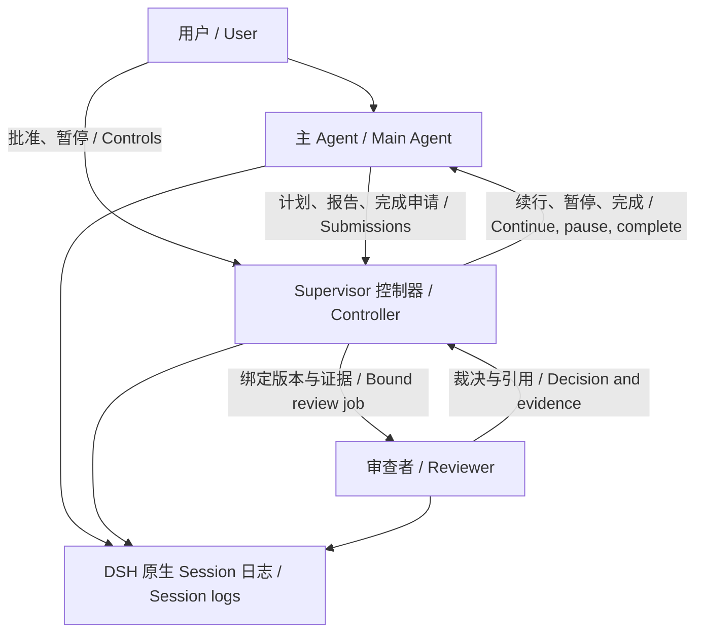
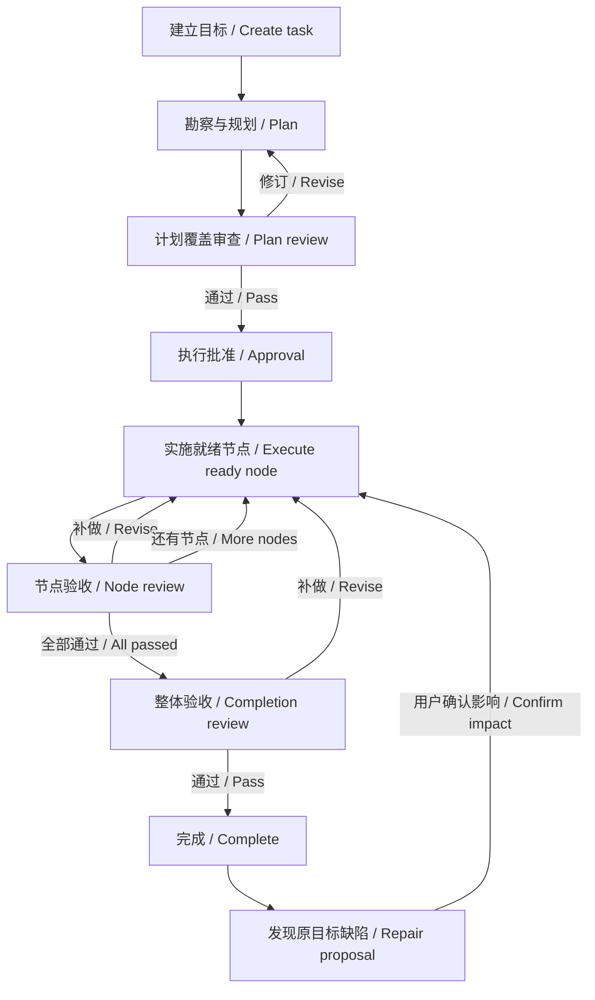

# DSH 长任务督导

[English](README.md) | 中文

[npm](https://www.npmjs.com/package/dsh-task-supervisor) · [反馈问题](https://github.com/gosomea/dsh-task-supervisor/issues) · [社区交流](https://github.com/deepseek-ai/deepseek-harness/discussions/8892)

## 概述

用 `/task` 把目标变成可跟踪、可暂停、可返工的任务，查看 DAG 进度，并在计划、执行和完成检查点取得审查意见。主 Agent 规划和交付；Supervisor 保存状态、调度审查，并根据有效裁决继续、暂停或结束任务。你可以在督导对话中整理要求、询问进度和明确修改任务。默认审查依据主会话日志；直接读取产物与隔离运行检查需要配置，审查通过也不能保证没有遗漏。

## 目录

- [开始使用](#get-started)
- [项目架构与职责](#architecture-and-responsibilities)
- [一个 Task 的完整流程](#the-complete-task-lifecycle)
- [审查者何时介入检查什么](#when-reviewers-intervene-and-what-they-check)
- [审查依据与独立验证](#evidence-and-independent-verification)
- [续行暂停与恢复](#continuation-pause-and-recovery)
- [理解实现与开发](#understand-the-implementation-and-develop)
- [进一步阅读](#further-exploration)
- [模型体验](#model-experience)
- [当前限制与后续工作](#known-limitations-and-deferred-work)

-----

<a id="get-started"></a>
## 开始使用

下文描述当前开发源码。npm **0.1.1** 是较早的预览版，仍使用专用 Supervisor preset，未包含本文全部增强；当前源码在原生模式中创建 Task。安装与版本边界见[公开 DSH 安装验收](docs/native-install.zh.md)和[原生模式中的任务督导](docs/native-task.zh.md)。

### 安装到 Web profile

已验证 Node 24 和官方 DSH `0.2.0-rc.2`，无需修改 Host 或原生沙箱。沿用该 profile 的模型配置；安装公开包：

```sh
dsh plugin --profile web add dsh-task-supervisor@0.1.1
dsh web
```

测试当前源码时，先按下方开发命令构建与打包，再使用 `dsh plugin --profile web add /absolute/path/to/package.tgz` 安装到隔离 profile。插件包含 Host、Web 客户端和可选检查网关；原生 DSH 组件由宿主提供。

### 建立与批准任务

在主会话输入 `/task <目标>` 即开始规划。单独 `/task` 等待下一条消息作为目标；已有未结束任务时查看当前状态，不恢复执行。`/task new <目标>` 是兼容别名。自然语言“创建一个任务……”也可由主 Agent 调用任务工具进入相同流程。

计划审查通过后，默认等待 `/task approve`、符合批准语义的主会话回复或侧栏的“批准计划”。也可明确设置审查通过后自动执行。批准只授权实施，任务仍须经过节点审查与整体验收。

主会话显示紧凑 DAG、参与 Agent、当前进度和简短审查通知。点击节点或“查看详情”打开完整侧栏；“对话”用于问询和整理要求，“详情”展示计划、节点、审查与任务操作。历史任务在更多菜单中只读查看。


*此前隔离验收的界面示例：保留“已通过 → 新尝试返工”的原因及依赖影响。*

-----

<a id="architecture-and-responsibilities"></a>
## 项目架构与职责

Supervisor 包含确定性的控制器和模型审查者。控制器持有任务状态与续行许可；审查者根据证据提供裁决。督导对话是面向用户的问询 Session，不等同于自动检查点审查。



| 角色或组件 | 实际负责什么 | 权限与边界 |
| --- | --- | --- |
| 用户 | 提供目标、约束、批准和必要决定。 | 首次执行默认手动批准；完成后返工每次点击确认影响。 |
| 主 Agent | 勘察、提出计划、实施、集成、汇报与申请完成。 | 可以提出完成，不能自行把 Task 标为已验收。 |
| Supervisor 控制器 | 保存任务与 DAG，准入执行轮次，启动审查，应用有效裁决，停止与恢复自有工作。 | 根据身份、版本、许可和证据有效性执行状态转换，不凭模型文字直接放行。 |
| 检查点审查者 | 检查该作业范围内的原始要求与证据，提出通过、修订或需要用户处理。 | 通常每个检查点新建独立原生 Session；同一作业补交或恢复保留其身份，不实施主工作区。 |
| 委派 Worker（可选） | 在 DAG 就绪节点的确切文件范围内执行子任务。 | 主 Agent 负责集成复验；Worker 报告不等于节点通过。 |
| 督导对话 | 整理目标、形成草案、解释进度，转交明确控制指令。 | 普通问询不暂停任务；控制指令交给同一个控制器核验。 |
| DSH Session 与投影 | 保存用户消息、执行记录、控制记录及审查关联，重建界面状态。 | 原生日志是事实来源；投影可重建，不另外维护需人工同步的任务历史。 |

当前源码保留主 Session 的原生 preset 和 Goal／Plan 工具。Task 存在时 Supervisor 通过公开 GoalService 解除原生 Goal 自动续行；原生 Plan/Todo 仍可组织工作，但不代替 Task 批准或验收。Supervisor 不充当通用 Team Lead；主 Agent 和 Worker 负责实施。

-----

<a id="the-complete-task-lifecycle"></a>
## 一个 Task 的完整流程

任务可跨多个模型轮次。图中的“审查”是提交之后由控制器接手的正式检查点；规划和执行期间还会按下节条件进行进展观察。



1. **建立要求。** 用户直接创建任务，或在督导对话中把宽泛想法整理成草案后建立。控制器绑定主 Session、任务 ID 与要求版本；原始用户要求始终是验收依据。
2. **勘察与形成计划。** 主 Agent 使用原生工具了解输入和工作区，提出验收标准与 DAG。规划阶段沿用原生权限，提示先勘察再批准实施，不把所有读取或 `run_code` 一概禁用。Supervisor 此时可审查规划进展，发现未知条件、重复活动或停滞。
3. **提交计划。** `task_submit_plan` 保存作业、待审计划、要求版本、证据截止点与审查 Session 身份，立即返回已提交并结束本轮。控制器在工具调用收敛后启动计划覆盖审查；需要修订则把具体发现交回主 Agent，通过后进入初始执行批准。
4. **准入实施。** 默认等用户批准；明确预授权才可在计划审查通过后自动执行。独立验证模式先检查已声明的必要能力和工具链。编辑要求会撤销原批准与预授权，重新规划；未改变要求的后续计划修订仍须审查，不无条件重复首次批准。
5. **实施 DAG 节点。** 前置节点必须审查通过，后继才就绪。主 Agent 用 `task_start_node` 登记当前尝试后实施，或在不冲突的文件范围委派 Worker。主 Agent 完成集成与复验后用 `task_report_stage` 提交节点证据；执行期间 Supervisor 可检查进展或在轮次结束后续行。
6. **节点验收与返工。** 节点审查通过才计入 DAG 并释放依赖；修订意见要求补做，不能接受该节点。已通过节点发现缺陷时，`task_rework_node` 重开目标和依赖后代的新尝试，保留无关分支与旧审查；重新提交须绑定当前尝试。
7. **检查整体交付。** 全部节点通过后，主 Agent 还须用 `task_request_completion` 提交当前整体结果。完成审查检查原始要求、各部分关系与必要证据；只有有效通过裁决才能将 Task 标为完成。补做返回实施，需要用户或内部故障则暂停。
8. **完成后继续使用。** 同一 Session 可创建下一项任务，旧任务进入历史。发现原目标缺陷时，先提出修复原因、根节点和影响范围，每次等用户点击确认后回到原 Task/DAG；旧完成记录保留，受影响节点和整体结果重新验收。

“审查已提交”不等于“审查通过”；原生对话中的一轮“已完成”也不等于 Task 完成。审查期间主 Agent 等待交接，界面显示作业种类、耗时、证据读取、最近活动、截止时间和下一步；待审 DAG 明确标为尚未批准。证据读取次数是活动指标，不是完成百分比或覆盖证明。

-----

<a id="when-reviewers-intervene-and-what-they-check"></a>
## 审查者何时介入检查什么

以下是同一审查引擎的五类作业，不是五个常驻 Agent。各作业绑定固定的要求、计划、节点尝试和证据截止点；表中的通过含义各不相同。

| 作业与阶段 | 何时触发 | 审查者实际检查什么 | 裁决交给控制器后 |
| --- | --- | --- | --- |
| `planning`：计划形成中 | 尚无提交计划的正常规划轮结束；规划活动达到观察阈值，或截断恢复后仍需检查规划。 | 从已记录勘察中区分已确认事实与未知问题，判断是否产生相关新进展，给出具体下一输出。 | 通过或修订仅允许继续规划；需要用户或连续无进展则暂停，不授权实施。 |
| `plan`：计划已提交 | 主 Agent 提交初始计划或修订计划；默认开启覆盖审查。 | 对照原始要求，核对标准来源、覆盖与可执行性、控制器归一化依赖边、验证顺序和所需能力；避免下游承担前驱验收而死锁。 | 通过进入有效批准路径；遗漏或弱化要求退回修订；缺用户决定则暂停。 |
| `progress`：正在实施 | 执行活动达到观察阈值，或未经节点报告的自动续行累计达到配置门槛。 | 查看就绪和执行中节点的实际产出、工具错误、重复行为与目标偏移，判断继续、纠偏或求助。 | 通过只表示继续当前工作，不接受节点；修订交付纠偏意见；需要用户则暂停。 |
| `stage`：节点提交验收 | 主 Agent 对当前节点尝试提交证据；委派节点须已有主会话集成复验。 | 核对节点对应要求、操作约束与证据；必要时读取子日志和集成记录，独立模式检查当前产物。 | 通过接受本次尝试并释放依赖；修订要求补做；需要用户则暂停。 |
| `completion`：申请关闭任务 | 所有节点通过后，主 Agent 申请完成。 | 核对原始目标全部必要要求与组合交付物，不能只汇总节点通过或接受主 Agent 总结。 | 有效通过才能完成；修订继续补做；未验证且需用户解决时暂停。 |

默认在原生安全步骤边界观察：累计 **24 个工具结果**、有工具活动且距上次观察 **5 分钟**，或连续 **3 次工具错误**，任一达到即可触发检查。没有新工具结果不会仅因墙钟时间触发；时间长也不自动判定跑偏。执行轮次另有 `maxAutomaticRoundsWithoutReport: 3` 兜底。正式裁决后重置观察窗口，不把审查耗时立即算成下一次主 Agent 进展检查。

`planningSupervision` 控制规划审查；`observeLongTurns` 控制轮内观察；`progressReviewMode: required-only` 跳过执行进展审查，保留计划、节点和完成检查点。上述阈值可配置，并非永久监视每次操作。生成达到输出上限时，控制器可按已确认上下文恢复下一轮；这项截断恢复本身不是审查通过。

-----

<a id="evidence-and-independent-verification"></a>
## 审查依据与独立验证

独立 Session 隔离审查上下文，不能单独证明审查者运行或观察过产物。界面显示实际生效模式；计划与进展作业使用日志审查，节点及整体验收按配置选择验证方式。

| 模式 | 审查者能做什么 | 结论边界 |
| --- | --- | --- |
| `reviewVerification: log`（默认） | 分页读取截止点内的用户要求、工具调用与结果、主汇报、子任务集成记录，以及可用的原生图片证据。 | 能核对已记录行为和证据，不能声称审查者自行执行了产品；看不到的行为明确未验证。 |
| `reviewVerification: independent` | 捕获包含适用未提交、未跟踪文件的产物快照，直接读取产物，并按要求使用已配置的隔离命令运行器。 | 仅支持实际具备的能力；仅读取可不配运行器，计算或行为需要执行时须具备相应环境；独立浏览器观察当前不可用。 |

显式选择 `independent` 并提供 `independentVerification.storageRoot` 才启用下述通用协议；需要运行检查时另配容器与工具链。仅保留旧 `independentVerification` 配置的 Session 使用兼容协议，不补造历史检查方案。独立模式的节点与完成审查按以下顺序展开：

1. **制定检查。** 先读完整原始要求、必要输入和约束，列出产物及可用能力。用 `task_review_check_plan` 保存要求来源、要确认的事实、方法、预期和覆盖；区分明确要求与推导假设，再展开交付物内容。
2. **独立检查。** 按要求选择读取、复算或执行，不按“代码／文档任务”套固定清单。核对现有测试的断言和操作路径是否支持要求；保存实际检查、失败、未验证、覆盖与局限。
3. **对照汇报。** 用 `task_review_observations` 持久保存独立发现后，才开放主 Agent 汇报、主执行日志与历史审查结论。调查差异，可追加检查，保留先前发现。
4. **提交裁决。** `task_review_decision` 引用本作业实际读取或运行的证据。控制器复核身份、版本及产物新鲜度后应用；文件存在、退出码零、测试数量多都不能单独证明要求满足。

必要能力缺失不能静默降级为通过。已知需求可在模型投递前准备，规划确定的需求在实施批准前检查。完整配置及能力范围见[独立产物检查](docs/implementation.zh.md)，协议与真实模型证据见[通用审查增强](docs/review-quality.zh.md)。

-----

<a id="continuation-pause-and-recovery"></a>
## 续行暂停与恢复

控制器在原生活动收敛后检查当前任务、许可、版本及待处理用户输入，再决定下一轮。续行消息包含当前目标、DAG/尝试、已记录进展和下一动作；不是仅发一句“继续”。提交计划、节点或完成审查后，工具结束本轮，控制器独立运行作业，外层 PTC 正常结束不取消已交接审查。

| 看到的状态或情况 | 含义与下一步 |
| --- | --- |
| 等待批准 | 计划已审查通过，尚无实施许可；批准当前计划，或先修改要求。 |
| 审查中 | 主 Agent 等待作业裁决；可看实时只读记录。审查活动数不代表验收百分比。 |
| 需要用户决定 | 审查发现必须由用户解决的条件；补充决定后手动恢复，不能用等待超时视为批准。 |
| 内部故障或审查超时 | 审查没有有效完成；保留作业、Session、错误和重试信息。`/task retry-review` 核对原作业后恢复审查，不自动批准或恢复此前暂停的实施。 |
| 规划停滞或截断恢复无进展 | 默认连续两次对应的无进展计数后暂停，等待检查问题并手动恢复。 |
| `/task pause`、`/task off` | 停止自有续行与在途审查，保留记录；`/task on` 只开启督导，`/task resume` 才明确恢复。 |
| 编辑要求或产物变化 | 旧版本裁决不能验收新工作；要求用 `/task edit <目标>` 修订，相关产物须重新核对。 |
| 宿主重启 | 状态从日志恢复，执行等待手动继续，不重复投递。只读打开页面不启动模型；冷 Session 的控制需通过主会话恢复。 |

普通日志审查默认十分钟截止；独立检查使用其配置截止时间，默认三十分钟。协议缺失可在同一作业、Session 和截止点内有限补交，耗尽后按内部故障暂停。用户暂停、关闭、版本变化和宿主退出具有各自取消语义，不把所有取消都自动重试。详见[审查作业生命周期](docs/review-queue.zh.md)及[进度展示](docs/review-progress.zh.md)。

-----

<a id="understand-the-implementation-and-develop"></a>
## 理解实现与开发

本插件复用公开 DSH Session、Inbox、生命周期与客户端扩展；精确协议由源码和对应文档维护。以下模块划分便于定位控制、证据和展示的责任。

<details>
<summary>模块分工与开发入口</summary>

| 代码 | 负责的部分 |
| --- | --- |
| [控制器](src/index.ts)、[审查队列](src/review-queue.ts) | 任务准入、原生续行、检查点交接和取消。 |
| [任务状态](src/state.ts)、[DAG](src/graph.ts) | 事件投影、依赖就绪、节点尝试与返工传播。 |
| [审查器](src/reviewer.ts)、[检查协议](src/verification.ts) | 绑定作业、证据访问、独立快照与检查、裁决及有限补交。 |
| [督导对话](src/consultation.ts)、[完成后修复](src/repair-runtime.ts) | 草案和明确控制交付、影响提案与点击确认。 |
| [面板接口](src/panel-api.ts)、[客户端](src/client/index.tsx) | 当前状态、只读历史/审查记录、主 DAG 与侧栏。 |

使用 Node 24、已安装依赖和未经修改的 DSH 源码 checkout；以下测试读取 `DSH_SOURCE`，不构建或改写该 Host：

```sh
pnpm install
pnpm run build
DSH_SOURCE=/absolute/path/to/deepseek-harness node spikes/kernel/typecheck.mjs
DSH_SOURCE=/absolute/path/to/deepseek-harness node spikes/kernel/run.mjs
pnpm pack --dry-run
```

真实安装与模型验证使用登记的隔离 `DSH_HOME` 和临时工作区，安装打包产物，保留失败证据。验证范围见[实现状态](docs/implementation.zh.md)；正式评测与开发回归分开。

</details>

-----

<a id="further-exploration"></a>
## 进一步阅读

以下页面分别维护实现、恢复、独立检查和评测，不把早期设计提案当作当前安装能力。

- [实现状态](docs/implementation.zh.md)：有效配置、已验证行为与能力边界。
- [原生任务](docs/native-task.zh.md)：preset、Goal/Plan 共存与旧 Session 恢复。
- [完成后修复](docs/completed-task-repair.zh.md)：影响确认、原 DAG 和旧验收保留。
- [通用审查增强](docs/review-quality.zh.md)：要求驱动的方法、证据覆盖与独立检查。
- [审查作业生命周期](docs/review-queue.zh.md)：工具交接、截止、取消及同作业恢复。
- [评测设计](docs/evaluation.zh.md)：公开基准、对照条件、指标与结果入口。

<a id="model-experience"></a>
## 模型体验

主 Agent 接收任务上下文，通过任务工具提交计划、开始节点、报告和申请完成；原始用户消息与回答保持原生显示。审查者只获得作业准许的证据和工具，按当前要求引用实际检查结果。督导对话复用原生聊天和压缩能力，普通问题不干涉执行。

审查模型默认跟随主 Agent 当前有效 DSH 路由，也可用 `reviewerModel` 从当前 profile 指定提供方、模型和推理等级。记录保留实际路由与 Session 身份。回复语言尽量跟随用户要求或显式语言配置；插件不能保证主模型内部思考语言。

<a id="known-limitations-and-deferred-work"></a>
## 当前限制与后续工作

当前源码每个主 Session 同时执行一个 Task，完成后可继续创建下一项。明确配置 `automaticContinuation: false` 不自动开启新轮；`executionApproval: after-review` 或 `/task auto-approve-on` 只预授权当前要求版本，编辑后失效。用户决策超时自动继续、多任务并行队列和 `/task plan` 入口尚未实现。

独立浏览器观察和检查目录自动恢复尚不可用；检查命令改动捕获的产物树会使本次证据失效。受控 Worker 默认最多两个，只能写分配的确切文件，任意 shell 与最终集成由主 Agent 负责。这些约束不等于禁止主 Agent 使用原生工具。

0.1.0 私有扩展日志须保留原宿主，本版不改写其历史。npm 0.1.1 的旧专用 preset 恢复需显式启用 `legacyPresets`。插件未加载时公开 Host 无法安装本插件的准入保护，不能把卸载等同于受保护的暂停。独立审查仍可能遗漏；安装与开发回归不证明长程成功率优于 Goal、Plan 或 Agent Team。

### Dev Note

<details>
<summary>维护者工作上下文（非规范）</summary>

无。

</details>
