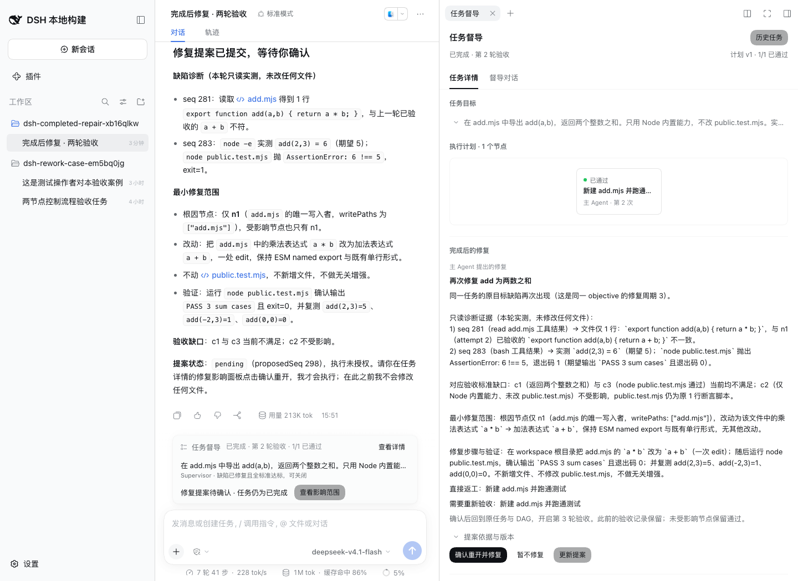

# 完成后修复验收记录

2026-09-28，独立验收增强方案步骤 1。验收对象为本次提交的完成后重开实现；步骤 2–5 的独立快照、运行器、两阶段审查和真实用户路径检查尚未实现。

## 环境与模型

复用 `dsh-plugin-isolated-test` 登记的 `supervisor-rework` 环境：Web 端口 61454、profile `supervisor-v2`、独立 DSH_HOME 和候选插件目录。宿主沿用 `deepseek-harness-supervisor-seam` 已有原生服务，不重建共享 DSH 核心或客户端。新案例由原生 RPC 在 TMP 创建并绑定工作区，没有让用户选择目录。日常用户实例 59909、其长任务及冻结 P2 公开题运行未替换。

真实主模型与七次审查均为 `deepseek-codebuddy/deepseek-v4.1-flash`，来自该隔离 profile 的模型路由。主 Session 为 `session-7e2da4aa-43f4-4ff0-8b5d-407d17519ff5`；任务为 `e6272b0b-7e51-4fb2-af3e-c8b6ec46948e`。认证启动地址、凭据和原始日志保留在私有测试目录，不进入提交。

## 确定性检查

| 检查 | 结果与覆盖 |
| --- | --- |
| `DSH_SOURCE=<seam> node spikes/kernel/run.mjs` | 11 个文件、101 项通过。原生宿主、投影、客户端请求以及历史恢复均在范围内。 |
| `DSH_SOURCE=<seam> node spikes/kernel/typecheck.mjs` | 宿主和客户端 strict 类型检查通过，包含测试夹具。 |
| 候选目录 `pnpm run build` | 宿主与客户端 bundle 构建通过；只构建独立候选，不覆盖用户实例的插件产物。 |
| 候选目录 `pnpm pack --pack-destination <private-check-dir>` | 六个声明入口/包文件完整，未包含测试状态或凭据；打包检查不等于发布。 |
| 资源清理修改后的六项聚焦回归 | 全部通过。每个 TMP 分配后立即登记，Context dispose 完成后再清理。 |

检查包括：未点击不能执行、真实写工具被拒绝、模型不存在确认工具、多根依赖并集只重置一次、无关分支保留通过、精确版本与产物核对、外部链接及超限显式失败、已占用执行名额不被抢占、同一提案幂等、历史任务恢复、伪造无收据状态被拒绝，以及重启后保持手动恢复。督导提案使用原生持续 Session，记录其来源与提出者，不被转成主 Agent 的实施指令。

原生文件夹具使用自有 TMP、Context 和脚本模型，HTTP 夹具只调用注册的 Fetch 处理器、不申请真实端口。软链接夹具在 Windows 显式跳过，因为需要独立验证链接权限；本次平台为 macOS。

## 真实模型、点击与独立命令

目标是在 `add.mjs` 导出整数加法，不修改外部提供的 `public.test.mjs`。测试操作者在完成后人为注入两次单行运算符回归，验证修复授权流程；这是控制流程案例，不是审查发现缺陷能力或公开题成功率评测。

| 轮次 | 原生记录 | 独立结果 |
| --- | --- | --- |
| 1 | 初始计划经浏览器批准；完成状态 seq 103、revision 9、attempt 1 | 外部 `node public.test.mjs`：`PASS 3 sum cases`。 |
| 2 | 操作者将加法改为减法；提案 seq 198；待确认时重启仍保留提案且文件不变；浏览器确认 seq 203；写入 seq 224；完成 seq 262、revision 16、attempt 2 | 同一外部测试再次通过；原任务 ID 与 plan v1 保留，历史重开 1 次。 |
| 3 | 操作者将加法改为乘法；只读诊断与中文主回答；提案 seq 298；浏览器确认 seq 305；写入 seq 326；完成 seq 364、revision 23、attempt 3 | 同一外部测试再次通过；原任务 ID 与计划保留，历史重开 2 次。 |

主日志中的三次写调用分别为 seq 58、224、326。两次修复写入均晚于对应点击收据；提案期间没有实施写调用，独立文件读取确认仍为注入的缺陷内容。原生日志提取的安全事件索引见[机器证据](completed-task-repair-evidence.json)。

最初开发候选在提交提案时强制结束模型轮次，导致主回答为空。本次修正为提案完成后允许主 Agent 原生收尾。第三轮提案后出现中文诊断、范围与等待确认的正常 Markdown 回答；插件没有复制或改写其回答。旧第一轮提案没有来源字段，界面不补造；第三轮保存 `main-agent` 与提出者 Session ID。

## 结论与边界

完成后同目标缺陷已经可以经明确点击回原任务与 DAG，并保留此前验收；模型不能将“修复”文字当成点击授权。实现已部署到登记的 61454 隔离实例，案例保留供继续检查。

本例只有一个节点。多根节点、下游并集与历史任务恢复由确定性原生宿主夹具验证，尚未在本次真实模型用例中逐项复现。工作区摘要绑定提案与点击，不是不可变验收快照；独立 shell 只读沙箱和外部并发写策略仍待后续运行器。审查仍核查主 Session 证据，没有新增自行运行代码的审查工具，也不能据此声称长程能力已优于 Goal/Plan。

[修复协议](completed-task-repair.zh.md) · [增强方案](10-plans/independent-verification/plans.zh.md) · [English](completed-task-repair-validation.md)
