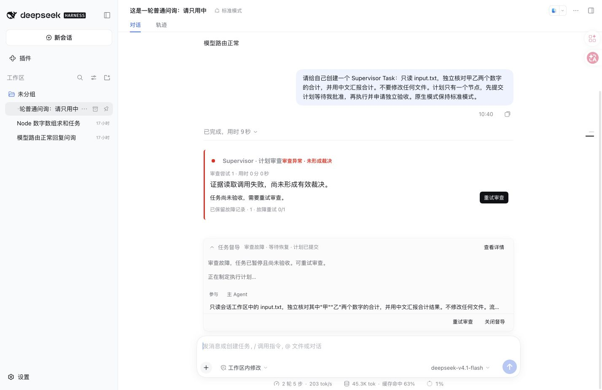
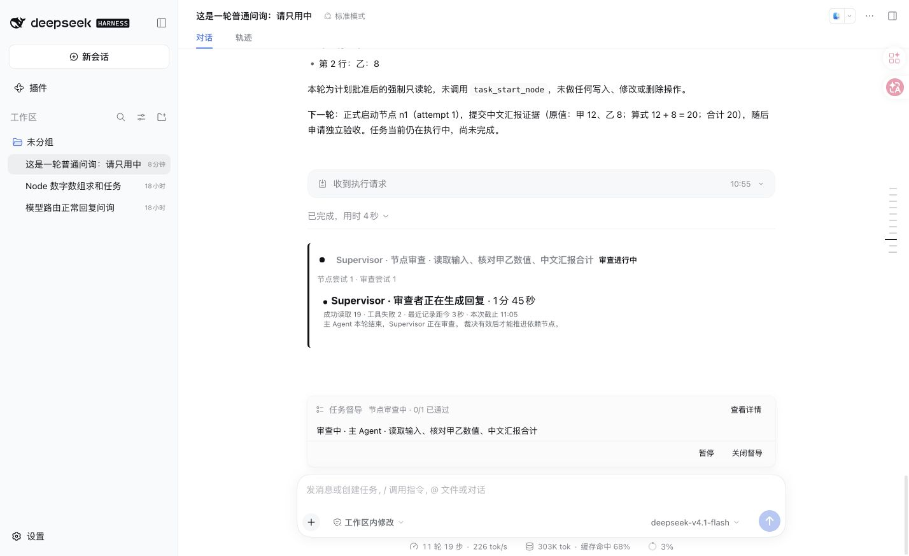

# Decision resubmission after corrected reads and collapsed review summaries

## Symptoms and cause

On October 9, 2026, inspection of the daily DSH Go task found two failed reads during the M8 review, followed by successful evidence reads. The reviewer ended with prose instead of `task_review_decision`. The controller treated any earlier failure in that Turn as the ending fault, incorrectly classified it as an evidence-read failure and blocked the permitted decision supplement.

This incident was not a PTC 120-second cancellation. An earlier node timed out and recovered in the same Session, then continued; M8 ended natively with `completed`. Correcting a read and submitting a valid decision are separate requirements: successful reads cannot replace a decision, and a missing decision cannot make a corrected earlier error the final failure.

Collapsed native review nodes offered a process link without a prominent status or recovery action. The DAG could also show a previous node's pass, making current activity difficult to distinguish from earlier outcomes.

## Corrected behavior

| Boundary | Current handling |
| --- | --- |
| Earlier read failure followed by successful tools; completed native Turn without a valid decision | One bounded supplement in the same job, retaining the reviewer Session, evidence cutoff and current deadline |
| Last tool outcome remains a failed read | Preserve the actual tool, result seq and redacted error; expose recovery |
| Supplement still contains only prose or cites unread evidence | Retain the fault and pause; no unlimited supplements or index-only evidence |
| User pause, disabling or version change | Existing cancellation and invalidation rules apply; no new execution authorization |
| Collapsed process | Retain Supervisor identity, kind, node, status, measured duration and recovery information |
| Current task permits retry | Show native Retry review in the summary; historical faults offer no current-task action |

Reader descriptions now state the index limit of 50 and the need to locate a seq before reading its original text. Fault retries and decision supplements remain separate counters. Original errors remain in the actual reviewer Session.

Explicit folding survives streaming updates and component remounts during the same activity. Settled activities default to folded, while a new activity defaults to open. UI choices are bounded and cleared on plugin unload. Expanded records still use the public native conversation factory, hiding its composer seat only within the review region; primary Agent output and input remain native. Only applied decisions display continuation or completion hints; stale and failed jobs do not imply execution permission.

## Verification

All **124 targeted regressions passed**: 72 cover decision supplements, presentation, event mapping, task state and reference cleanup; another 52 cover controller recovery, pauses and evidence inheritance. The second run used a name filter, leaving 117 tests unselected. Strict Host/Client types, build and packing passed. A negative control on the earlier implementation first demonstrated rejection after corrected reads; the corrected implementation then passed.

An official isolated `@deepseek-ai/dsh@0.2.0-rc.2` Host used that day's CodeBuddy `deepseek-v4.1-flash` route and completed two read-only numerical Tasks in one Session, each with one initial approval. The first used a test proxy to inject deterministic boundaries: a final failed plan read; a manual retry followed by a real-model decision; then two failed node reads, successful reads and a prose-only ending. The controller allowed exactly one supplement. The real model then submitted a valid decision and automatically proceeded through final acceptance. The second Task used the ordinary route without injected failures and also completed node and final reviews.

Injected cases are not naturally observed faults. The real reviewer also attempted unread citations; the tool rejected them, and the model read the originals before resubmitting. Passing did not bypass citation eligibility. These runs use log mode; reading the primary Session is not independent artifact verification.

Browser acceptance confirmed visible fault and retry summaries, one node per retried job, persistent folding across streaming updates, actual tool errors in expanded history without a second visible composer, and no horizontal summary overflow at 760×900. Refresh retained six distinct review nodes for the two Tasks; expanding history did not dispatch a model. Browser testing caught an incompatible native slot combination in one candidate pack. That combination was removed, and the final pack was installed and verified again.

See the safe [machine acceptance record](2026-10-09-review-repair/validation.json). These screenshots show isolated test Tasks, not private logs from the original long task.

## Deployment and inspection

The registered environment is `supervisor-release-012-20261008`, at `http://127.0.0.1:51230/`, profile `release-check`. Case `repaired-reader-ui-20261009` binds its TMP workspace and test Session. Inspect the registry before reuse; authentication entries and raw logs remain in the local cache.

Final candidate tarball SHA-256: `2e662d9da1b30f7ec8d6bfcc1b592225ddbec4b07a3d5012a97b9ac4211cb7c2`. Every installed file was compared with the tarball. The candidate retains the 0.1.3 manifest for local installation and does not replace the public npm version.

The daily 3080 Host was not restarted, and M8 was not retried automatically; it still loads published 0.1.3. After upgrading the plugin, the existing fault can use Retry review. This work does not claim to have resumed the daily long task or change approval and manual restart-recovery boundaries.

[中文](2026-10-09-review-repair.zh.md)
