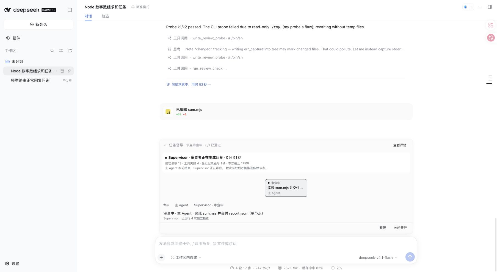
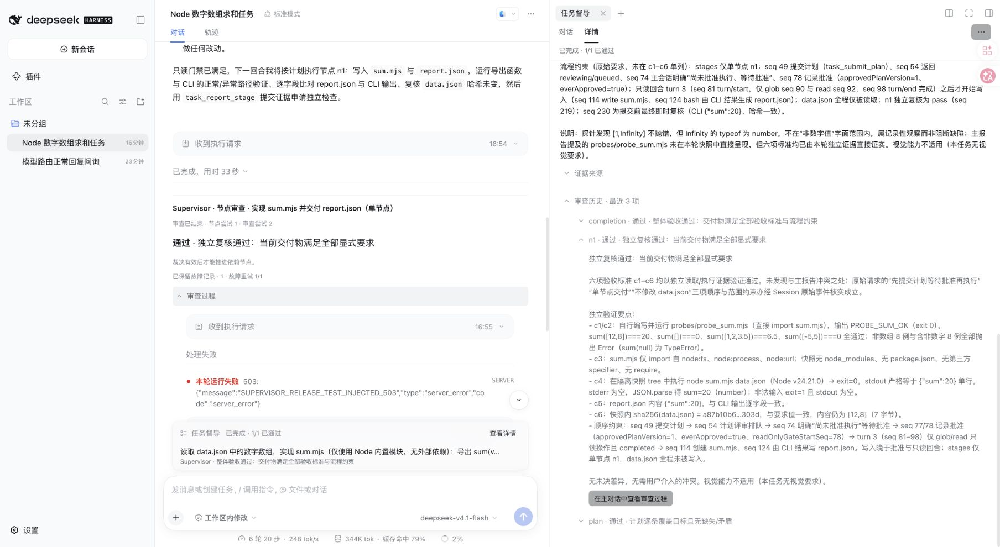
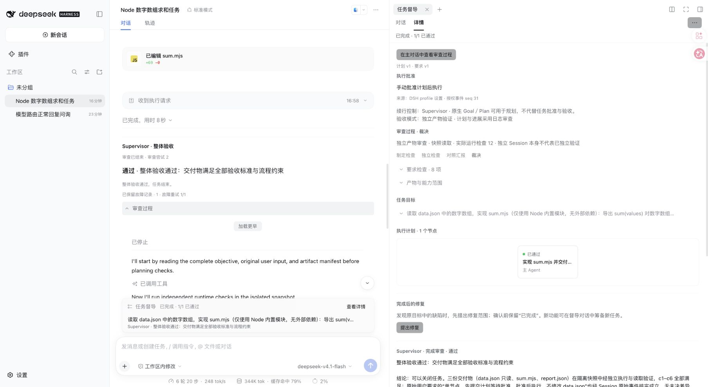

# 0.1.3：审查过程与有限恢复

2026-10-08 已发布到[官方 npm](https://www.npmjs.com/package/dsh-task-supervisor/v/0.1.3)，latest 为 0.1.3；公开包与冻结包逐字节一致。[GitHub Release](https://github.com/gosomea/dsh-task-supervisor/releases/tag/v0.1.3)提供同一压缩包。官方 DSH 0.2.0-rc.2 的干净公开安装已通过。

## 本版变化

主 Session 现在直接展示 Supervisor 的原生审查对话，绑定实际作业介入位置，包含审查类型、节点尝试与审查尝试。运行时展开，结束后收起，保留裁决和下一步；历史展开才保留审查 Session 引用，收起释放。主 Agent 的回答保持原样，没有新增审查输入框。回复、工具组、错误、耗时和思考沿用原生展示设置。

DAG 表示任务进度，侧栏表示要求、检查范围与历史，过程只在主对话展示一次。当前动作与此前裁决分开，显示实际耗时、最近记录、工具和截止时间；不会把上一节点通过解释为当前节点正在通过。

提交计划、节点报告、整体验收及手动重试均快速返回，再由控制器运行审查。内部超时及明确的暂时请求故障默认重试一次，沿用原作业、Session、证据截止点、要求版本、节点尝试与快照。协议补交另计，不延长当前尝试截止。

原批准和版本仍有效时，重试成功后接续执行。用户主动暂停、关闭、宿主重启、需要用户决定或旧记录没有许可时等待手动恢复。首次计划仍遵循原批准策略，恢复不生成新授权。审查控制记录升级到 7；真实成功工具结果可恢复读取资格，失败、索引摘要和模型自述不能提供引用资格。

所有改动在插件中；没有修改 DSH 主循环、PTC 超时或原生沙箱。完整流程见 [README](../../README.zh.md) 和[过程与恢复](../review-experience.zh.md)。

## 配置与升级

| 配置 | 默认 | 范围 |
| --- | --- | --- |
| reviewFaultRetryAttempts | 1 | 0–3，同作业故障重试次数 |
| reviewFaultRetryDelayMs | 3000 | 0–60000，等待毫秒 |
| resumeAfterReviewRecovery | true | 仅沿用原有效批准 |

使用官方 DSH 插件命令安装：

```sh
dsh plugin add --profile <你的profile> dsh-task-supervisor@0.1.3
```

新任务保持原生模式，不注册 Supervisor preset。旧记录可以读取；没有原生父子 descriptor 的早期审查不能嵌入原生子对话，兼容读取接口仍可读取，不改写历史。没有执行许可的旧作业不获得自动续行权限。升级在空闲时重启用户自己的实例；本轮没有重启 3080 的在途任务。

## 验收结果

| 检查 | 实际结果 |
| --- | --- |
| 针对性内核与 Host 回归 | 28 文件，405 通过，13 跳过 |
| Host／Client 严格类型检查、构建 | 通过 |
| PTC 长审查边界 | 受控审查实际运行 125 秒后完成，超过 120 秒；主工具已提前返回 |
| 日志模式真实模型 | 同一 Session 连续两个 Task；各一次批准；计划、节点、整体均通过 |
| 独立模式真实模型 | 实际读取三份产物、运行 Docker 检查；节点 6 次运行，整体 12 次运行 |
| 请求故障恢复 | 仅首次节点请求注入 HTTP 503；同作业与 Session 自动重试一次，通过后续行 |
| 实际审查超时恢复 | 整体验收首次超过配置的 300 秒；保留已有检查和 Session 重试一次并通过 |
| 历史／刷新 | 日志 Session 六个唯一作业，独立 Session 三个；默认收起；查看历史新增模型请求 0 |
| 展开／收起 | 原生工具、错误与回复可见；收起后原生视图数量 0；没有可见审查输入框 |
| 布局 | 760×900 窄屏、长记录、侧栏定位与历史翻阅检查通过；没有强制滚到底部 |

13 项跳过为未向普通内核命令提供 Docker 参数的条件测试：5 项 gateway、7 项命令运行器及 1 项受控缺陷场景。真实模型独立用例另行使用固定 Docker 镜像运行，不能因此把跳过项记为通过。Windows、其他浏览器和其他 DSH 版本未在本轮执行。

两类真实用例使用当天 CodeBuddy 的 `deepseek-v4.1-flash`；主 Session 与全部审查 Session 的实际请求头均核对。日志用例全部 Session 的原生报告 token 为 **1,828,258**（含一次路由健康问询）；独立故障用例为 **4,783,475**。包含缓存输入，不代表付费 token；没有 usage 的失败请求消耗未知。独立用例的检查次数包含失败后重做的命令，不等于覆盖比例。

503 由本地转发代理注入一次；只在该隔离用例禁用原生 llm-retry，确保故障到达 Supervisor。没有给模型追加救场、隐藏测试或新批准。整体验收超时并非注入。两次恢复分别消耗各自作业的一次额度。原始输入哈希保持不变，检查失败与探针修订仍保留在原生记录中。

脱敏机器证据：[0.1.3-checks.json](0.1.3-checks.json)。截图：







## 发布安装

发布使用冻结后的同一个 npm tarball，核对官方 DSH 干净 home 安装、实际 Host／Client 文件和加载。公开版本、latest、摘要、标签及 GitHub Release 在机器证据中记录。

这些结果验证可用性与恢复正确性，不是公开题对照；没有盲审的纠偏率、误暂停率和误验收率保持 `null`。没有新增独立浏览器执行器，也不宣称优于 Goal、Plan 或 Agent Team。

[English](0.1.3.md)
