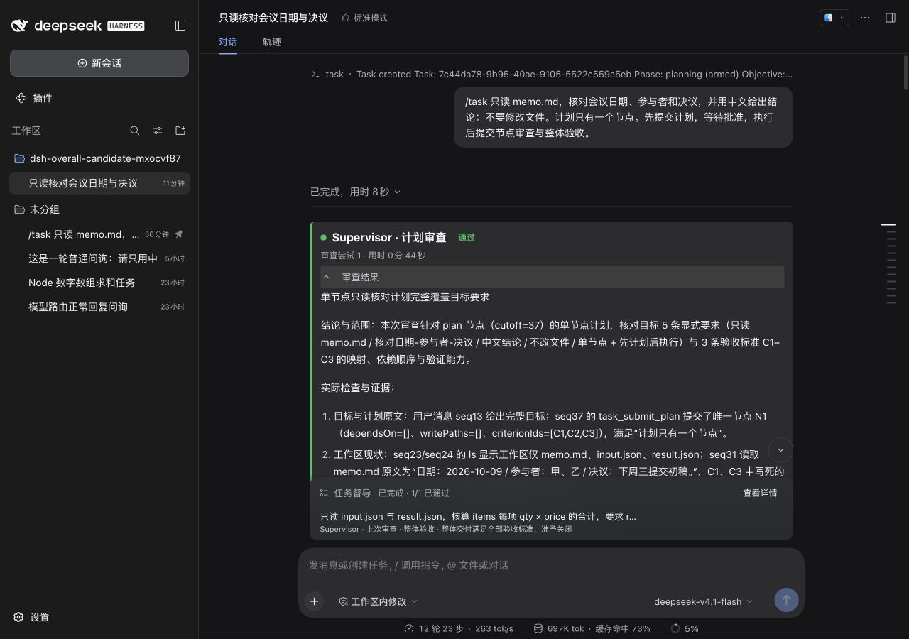
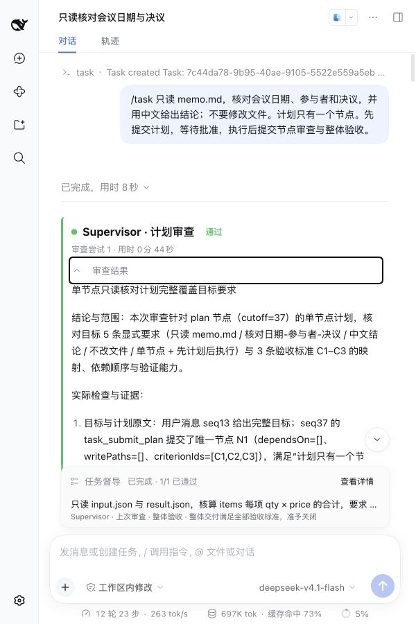
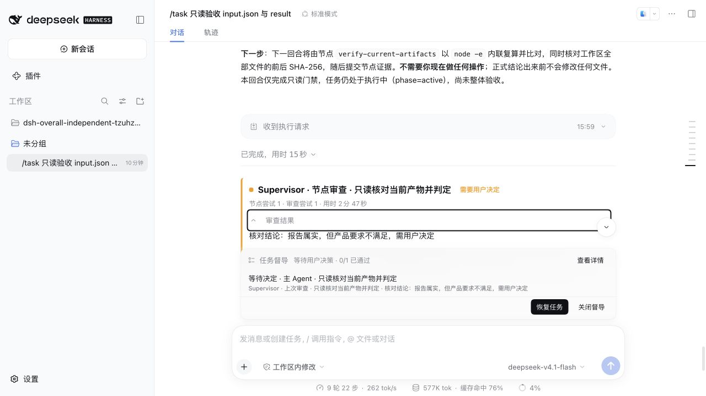

# 0.1.4: complete reports and scoped review

Validated on 2026-10-09. Publication is awaiting npm account authentication; this record distinguishes acceptance from public availability.

## Changes

The primary Session displays the complete durable `finding` in native Markdown, open by default. Native process details fold separately. No second model summary or primary-Agent impersonation is added. Long reports use conversation scrolling; local browser preferences retain separate folds after reload. Submitted, applied, stale, historical and currently user-cancelled reviews have distinct state explanations.

New jobs bind Task identity, requirements/plan versions, node attempt, evidence cutoff and locator scope. Earlier constraints retain sources and uncertain attribution. `read_task_evidence_batch` expands at most six located originals with individual errors, read ranges, truncation and next offsets. Summaries and failed reads cannot authorize citations. Record 8 preserves version-1–7 reading, their original protocols and permissions.

Plan, node and final reviews save requirement-level source, method, actual evidence, status, coverage and limits. Independent mode reuses its check plan and recorded findings. Explicit failed or unverified requirements prevent a pass; unrelated derived preferences do not block correct work. Final acceptance inspects the current combined snapshot. Continuation carries the actual scope, confirmations, remaining requirements, revisions, evidence and ready nodes; the controller determines the next action.

Changes remain in the plugin; review frequency, DSH main loop, PTC timeout and native sandbox are unchanged. No independent browser or vision executor was added. [Review process](../review-experience.md) describes recovery and capability boundaries.

## Configuration and upgrade

`reviewReadCorrectionAttempts` defaults to `1`, range `0–1`, accumulated per job across fault retries. It bounds a controller-delivered correction Turn when a settled reviewer ends on a recognized argument, pagination or locator failure. Ordinary native in-turn corrections remain in the transcript and are not counted as extra correction Turns. Correction and protocol supplements do not extend the attempt deadline or grant new authorization.

Existing bounded temporary-fault retry and valid-permit continuation remain. User pause, disabling, restart and user decisions remain manual. Old jobs obtain no fabricated evidence, requirement results or continuation authority.

After publication, install into an ordinary native-mode profile:

```sh
dsh plugin add --profile <your-profile> dsh-task-supervisor@0.1.4
```

Upgrade when idle. Daily port 3080 remained on its original process throughout this work.

## Acceptance

| Gate | Actual evidence |
| --- | --- |
| Kernel and native Host | 31 files, 452 passed, 0 skipped, including configured Docker gates |
| Strict Host/Client types and build | Passed |
| PTC boundary | Controlled native review lasted 125.30 real seconds; submission returned earlier and the verdict applied once |
| Ordinary clean installation | Official DSH 0.2.0-rc.2, empty home, native standard preset, 12 package files byte-matched; /task status succeeded with 0 model calls |
| Log-mode real models | Both versions completed static and calculation Tasks in one Session per version; one successful initial approval per Task |
| Independent-mode real models | Correct calculation completed with 8 executed checks; wrong sum 23 was independently rejected against 22, with 1 executed check and needs-user pause |
| Browser history | Six unique jobs after refresh, separate report/process folds retained; collapsed transcripts 0; history added 0 model requests across main and six reviewer Sessions |
| Layout and result | 1280×900 and actual 600×900 checks; complete tool-only reports, no inner fixed height; native tools and errors remain expandable |

Controlled regressions cover successful/partial batch reads, rejected unread/summary evidence, same-job restoration, finite correction and retry, user cancellation, stale snapshots, restart/manual recovery, static artifacts, behavior gaps, misleading reports, unavailable capabilities and unrelated preferences. Real-model acceptance does not replace these deterministic negative controls.

Actual primary and reviewer request headers all identify CodeBuddy deepseek-v4.1-flash through the daily native route. The initial collector read the wrong header nesting; an append-only supplement uses data.header.config. Original sealed results were not overwritten and models were not replayed.

## Frozen development comparison

Baseline 6cccfd3 and candidate runtime 52dcbb0 used the same official Host, provider, profile options, fixtures, approval policy, observation frequency, fixed order and 900-second deadline. One paired repeat covers two fixtures, four positions. Paused work received no rescue. A final presentation-only fix followed the trials: all six backend/executor .mjs files match the tested archive byte for byte; only client.js changed. The final tarball was reinstalled cleanly and used for browser verification.

| Case | Baseline / candidate reward | Seconds, baseline / candidate | All reported tokens, baseline / candidate | Reviewer calls, baseline / candidate | Tool errors, baseline / candidate |
| --- | --- | --- | --- | --- | --- |
| Static memo | 1 / 1 | 224.114 / 295.120 | 859,816 / 1,377,401 | 57 / 56 | 2 / 9 |
| Calculation | 1 / 1 | 242.968 / 272.073 | 1,444,692 / 1,182,938 | 70 / 48 | 3 / 6 |

Both matched versions passed the deterministic artifact/content oracle. Candidate outcomes retain 5–7 requirement results per review; the old baseline has no such field, which is missing historical evidence rather than zero coverage. Candidate cost is not consistently lower, and stricter decision validation produced more corrected native tool errors (all matched reviewer errors were decision submissions). Both used 0 internal fault retries and 0 controller read-correction Turns. Exact repeated-read calls were 0 under the recorded name-plus-arguments metric.

Independent positive: 657.017 seconds and 4,705,865 reported tokens; negative: 283.864 seconds and 1,399,483 tokens. Both preserved fixture files. The negative oracle checks rejection and pause, not task completion. Independent reviewer failures were 35 and 10 respectively, including corrected protocol/argument attempts; the reports do not claim zero-error operation. Token counts include cached input and are not paid tokens; failed requests without usage are unknown.

Earlier diagnostic Sessions are retained but excluded from the comparison: the runner attempted approval while the Agent was busy and initially treated an error receipt as approval. Same-Session continuation preserved the deadline; baseline completed at 759.215 seconds, candidate reached 902.036 seconds and was paused. The corrected frozen runner waits for idle and validates each receipt. A separate initial final-test invocation omitted its storage parent, causing 20 ENOENT fixture failures; creating that required directory yielded the complete 452-pass rerun. Neither incident was hidden as a passing gate.

This is one repeat of local development fixtures, not a public benchmark or a statistical superiority claim. False acceptance and false pause remain null without blind labels. Windows, other browsers, independent visual judgment and other DSH versions were not tested.

## Evidence and release artifact

Machine record: [0.1.4-checks.json](0.1.4-checks.json). [Fixtures and frozen runners](0.1.4-fixtures/) contain only the public test inputs and adapter source. Runner deployments and raw authenticated Session logs stay outside Git.

Frozen tarball SHA-256: e35394e370a70a9b6d22dc49a19023f1f4b431578f94c271a3e07fa3a0643d82. Publication and public-install checks will be appended after npm authentication, using this same archive.







[中文](0.1.4.zh.md)
