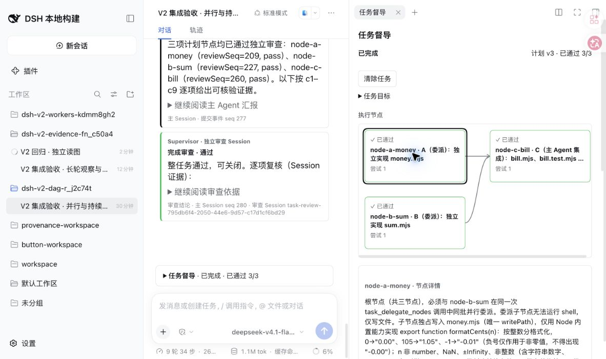
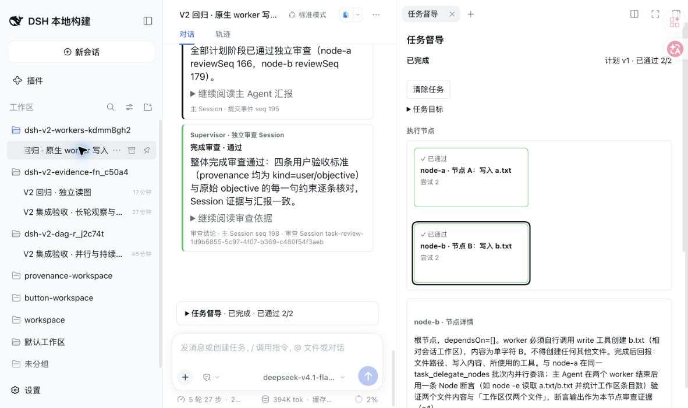

# V2 第二、三批联合验收

## 范围与环境

按[三批实施提案](supervisor-experience-v2.zh.md)合并第二、三批开发后验收。这里验证可运行的插件机制；正式长程效果对照仍按[评测协议](evaluation.zh.md)另行开展。

- 复用环境注册表中的 `supervisor-v2`：端口 59909、profile `supervisor-v2`，隔离 home 为 `${TMPDIR}/dsh-supervisor-v2-ipco8jot/home`，插件副本为同目录 `plugin`。源码来自独立的 `deepseek-harness-supervisor-seam` checkout。
- 原用户验收实例 `supervisor-user`（31973、PID 94963）保留；日常实例（3080、PID 11374、`~/.dsh`）未重启、未修改其 profile 或服务中的 bundle。最新隔离构建为 `566069f`，PID 26276；PID 是本次验收截面，不应当作下一次操作的依据。
- 主 Agent、审查者、worker 与督导对话使用 `deepseek-codebuddy/deepseek-v4.1-flash`，请求走本机 15721 的 `/tencent/v1`，实际响应模型标识为 `deepseek-v4.1-flash-ioa`。这是 skill 指定的 CodeBuddy 首个模型；检查时日常新会话默认已是 `minimax-m3`，因此不声称本轮与日常默认选择完全一致，也没有改日常配置。
- 工作区通过原生 workspace/session API 自动绑定，Session 记录的 cwd 与绑定路径一致。多个案例共享同一个 Host；每个需要新夹具的案例在 TMP 新建目录，视觉回归复用同一只读夹具目录。注册表保留案例用途、路径和 Session ID。
- 认证使用当前 Host 打印的完整启动 URL，在验证浏览器完成登录；token 仅留本地私有日志，不进入文档或 Git。新浏览器访问裸端口仍需先完成登录。

## 检查与真实案例

| 检查 | 观察到的结果 | 证明范围 |
| --- | --- | --- |
| 内核回归 | 7 个文件、52 项检查通过；包括失败工具后禁止下一模型步骤、idle 后用户仍可问询 | 状态机、取消、版本与文件归属门禁；不证明真实模型判断质量 |
| 严格类型检查 | 宿主与 Web 客户端分别通过 | 实际宿主源码接口上的类型兼容 |
| 构建与包 | Node 24 构建宿主和客户端；包包含 6 个必要文件 | 可加载入口及包内容；安装方式为源码 `link:`，未验证发布到 registry 后的安装 |
| DAG 与集成 | A/B 独立根节点 → C 汇合，最终 3/3 通过并完成 | 依赖门禁、节点审查、最终审查与 UI 投影 |
| 持续督导对话 | 普通问询未改变任务版本；文字批准、暂停、恢复产生持久 received/applied 回执 | 问询与控制分离，同一控制器处理干预 |
| 压缩与重启 | 原生命令确认压缩 46 条历史、约 40022 tokens；之后仍能回答当前任务，重启保留绑定 | 复用原生 Session 和压缩；主执行仍等待手动恢复 |
| 长轮观察 | 默认 24 次工具结果阈值触发独立进展审查，cutoff 112 | 在同一长轮中观察；pass 未把节点提前标为通过 |
| 原生图片证据 | 独立节点及最终审查都实际读取图片事件 40，并识别红色 | 图片进入真实模型；不证明复杂场景的视觉评分质量 |
| 原生 worker 写入 | 最终回归结果见下文 | 子 Agent 自写文件、主 Agent 集成及独立审查 |

本次确定性检查：

```sh
DSH_SOURCE=/absolute/path/deepseek-harness-supervisor-seam node spikes/kernel/run.mjs
DSH_SOURCE=/absolute/path/deepseek-harness-supervisor-seam node spikes/kernel/typecheck.mjs
pnpm --dir /absolute/path/isolated-plugin build
```

前两条在插件源码目录执行，均使用 Node 24。构建只在隔离副本执行，避免重写旧用户验收实例正在服务的 lib。

### DAG、持续侧问和恢复

主 Session：`session-f697363e-74f6-4441-8ddc-e1471e5321ac`，任务 `0f076531-b98a-44b2-bc26-33fe723a39f2`，工作区 `dsh-v2-dag-r_j2c74t`。最终 `complete`、revision 23、计划版本 3；A/B/C 的通过事件分别为 209/227/260，完成审查 cutoff 278。

督导对话绑定 `task-chat-session-f697363e-74f6-4441-8ddc-e1471e5321ac-0f076531-b98a-44b2-bc26-33fe723a39f2`。在审查进行时发普通问题，任务继续；发“暂停任务”则取消审查。手动恢复保留已完成 worker 的尝试及证据截止点，仅重做中断的审查。原生压缩后用三句话问询，仍能描述当前节点、审查进展和待办，没有触发执行控制。

独立于主 Session，再执行产物测试：9 项 Node 测试通过；另外遍历 -1250 到 1250 的 2501 个整数分格式化用例，检查非法输入、组合输出和恰好四个文件，均通过。这些是受控小任务功能检查，不是保留集评分。

浏览器中主 Agent 与 Supervisor 卡片明确分开；侧栏 DAG 显示 A/B → C 和 3/3 通过。关闭侧栏后主会话当前任务折叠块仍显示同一图与节点详情。截图记录：



### 长轮观察与图片

长轮 Session `session-9a0cc586-f3e1-4821-88fd-b9546b8b0b4b` 在 `dsh-v2-evidence-fn_c50a4` 读取 25 个文本夹具与一张 64×64 红色 PNG。默认阈值触发进展审查后继续同一节点；之后旧构建因图片读取工具缺少 `llm` 注入无法审查，正确进入 `needs-user`，没有完成任务。此运行保留为失败样本。

修复后，Session `session-f8387158-d710-4e52-b41c-d4038972454f` 在同一只读目录独立回归：主会话 `read_image` 结果为 seq 40，节点和最终审查各自调用原生图片读取，`imageSeqs=[40]`，均判断为红色；最终 `complete`、revision 8。附件 SHA-256 为 `1a408b8566731a5d50bca8e0d267f26e89a08c88bf9db8b1fac73afaf2da39dc`。验收后 26 个夹具哈希未变。

### 原生 worker 写入回归

Session `session-41b47ae7-a4e5-414b-8a9f-83da1607d628`，任务 `616fd404-100b-43f2-9163-11463e437487`，工作区 `dsh-v2-workers-kdmm8gh2`。两个根节点分别仅拥有 `a.txt`、`b.txt`，要求 worker 自己写入单字符 A/B，主 Agent 不得代写；两个 worker 结束后才由主 Agent 执行只读 Node 断言，再分别审查及申请完成。

第二次尝试在 `566069f` 上完成，最终 `complete`、revision 17。两个 worker 分别为 `task-node-a897b5d5-bf0d-448d-b1f7-ed505fb63720` 与 `task-node-a55c2a4a-bbd7-4e1f-8f78-084835e391bf`；两者原生 turn 的时间区间重叠约 14 秒，均在自己的 seq 24 调用 write、seq 25 成功、seq 37 正常结束。目录已有第一次尝试留下的文件；原生文件工具要求先读再写，两个 worker 按错误提示读取后重试成功，未绕过该约束。

主会话 seq 152 同批委派，seq 155 返回两个报告；seq 159/160 为成功的只读 Node 集成断言，seq 166/179 分别通过两个节点，最终审查 cutoff 196 通过。读取完整主会话确认没有 write/edit，bash 仅检查和断言。外部再次断言 a.txt=A、b.txt=B 且恰好两个文件，通过。此次真实成功使用专用报告工具；正常最终文本的兼容及空报告失败收敛另由确定性原生宿主回归覆盖。



## 首次失败与修复记录

| 首次问题 | 修复与证据 |
| --- | --- |
| 三节点目标被规划为五节点，用户约束被标为实现选择，审查漏报 | `7943d15` 明确依赖表示验收通过、前置节点的验证不能等待后继；保留指定节点数和需求来源。同目标重规划后为三个节点。首次漏报不计通过。 |
| 中断审查恢复时丢失已完成 worker 证据 | `939d1d3` 保留已完成尝试与日志截止点；恢复只重做审查。内核与真实暂停/重启/恢复通过。 |
| Web 的文件工具只注册在父 Agent，worker 全局目录找不到 write | `b396779` 从父 Agent 原生工具视图注册受限文件工具，测试夹具改成真实 Web 作用域布局。原账单案例由主 Agent 代写的降级过程不计为 worker 写入成功。 |
| 独立图片读取缺少 Cordis 服务注入 | `b396779` 声明 `llm` 注入，真实独立读图回归通过。 |
| worker 正常最终文本被误判缺少报告 | `ff4c3bc` 使用 DSH `finalAssistantOutput` 接受正常结束后的非空文本，仍需集成和独立验收。 |
| worker 失败后主 Agent 在暂停状态继续重试 | 增强回归发现失败工具的 concludeTurn 标记无效；`566069f` 在原生 pre-step 拒绝当前失败轮，idle 后释放以允许后续用户问询。52 项检查通过。 |
| 督导对话 profile 未挂载原生 compact，模型把文本请求误称压缩成功 | 隔离 profile 启用原生 compaction-basic/command-compact，并从原生命令菜单执行；以真实压缩记录确认成功。普通文本回复不计压缩证据。 |

## 边界与后续验收

- 真实检查覆盖受控小任务和机制组合；尚未重跑完整神社项目，未证明长程成功率优于 Goal、Plan 或 Lead–Worker Team。完整神社回归、独立保留集与配对效果对照仍待执行。
- worker 共享工作区且仅允许原生文件工具写入所属确切文件，不允许任意 shell；测试、构建和最终集成由主 Agent 执行。独立工作树和更广工具委派尚未实现。
- 子 Session 可通过插件的绑定证据工具读取；通用 DSH 子 Agent 目录尚未登记这些专用 worker/reviewer，通用 child Session 页面读取可能报 descriptor 不可用。它不影响绑定审查工具，但独立子会话浏览体验仍待接通。
- 图片能力确认的是内容送达和简单颜色判断；浏览器页面的语义质量、复杂三维场景与动作验收仍需专门案例。
- 普通问询已验证不控制任务；明确介入工具当前识别有限的直接指令，不能把任意自然语言都当授权。
- 原始模型推理及原生压缩摘要仍可能为英文；用户可见任务汇报、独立审查和督导回答已验证中文。
- 原型仍依赖尚未成为标准 DSH 公共接口的持久化扩展，不能把本次隔离验收视为可安装到任意发行版。

[English](v2-integrated-validation.md)
