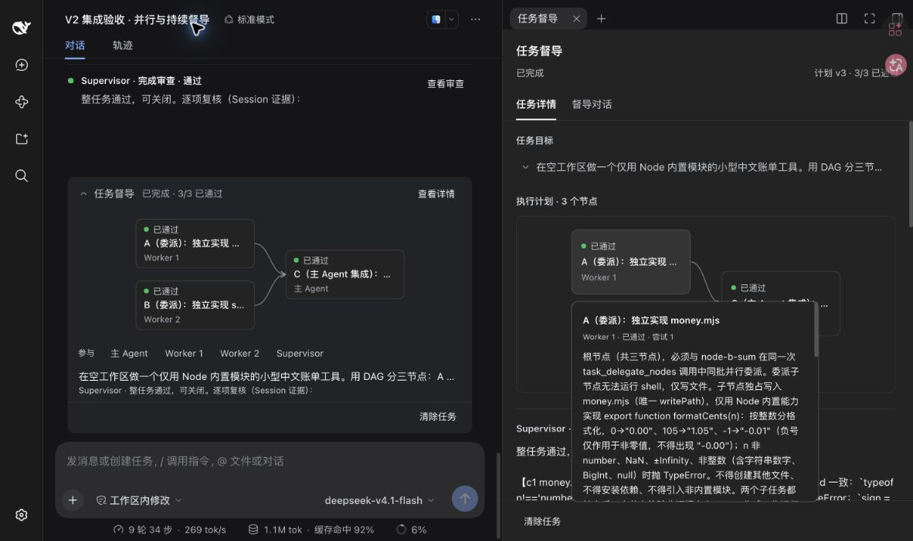
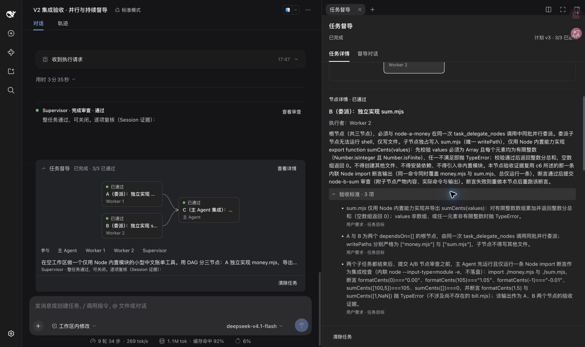
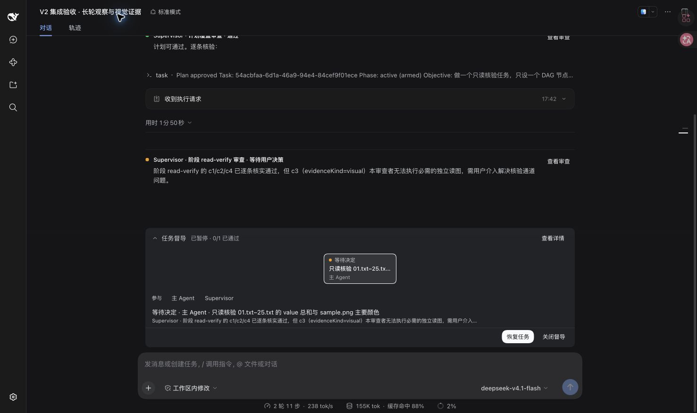

# V2 UI hierarchy and native-answer validation

## First-pass changes and rationale

The main conversation presents the main Agent's native answer and concise task progress. The sidebar holds complete details and persistent consultation. This replaces duplicate submission cards and vertically stacked detail/chat content while preserving one task controller.

| Reported issue | Implementation |
| --- | --- |
| Crowded DAG and heavy outlines | 154×68 nodes show title and status, joins are centered, and DSH theme variables style the graph. Hover or keyboard focus reveals descriptions and criteria; selection keeps full details visible. |
| Controls disappear while scrolling | The sidebar scrolls its content separately from the action footer. Inline actions remain in the native composer dock. |
| Duplicate progress and excessive inline detail | The executor rejects `todo_write` during unfinished supervised tasks. Main-conversation summaries link to complete sidebar content. Native todos are not a second Plan scheduler. |
| Details compete with consultation | Separate Task details and Supervisor conversation tabs preserve the mounted native conversation and its draft. |
| Main-Agent cards obscure native output | Remove duplicate main-Agent cards. After committing a successful checkpoint, permit one tool-free native response before normal controller continuation. Supervisor findings retain their own short summaries. |

Prompts ask for short node titles and first-line review headings in the task language while retaining complete fields. One node response used a premature whole-task heading before final review; control state still required completion review. A further prompt explicitly distinguishes checkpoint acceptance from `phase=complete`. Model wording does not decide completion.

## Automated and real-model evidence

- Seven kernel files and 55 checks passed. New cases cover ordinary-session todos, one native checkpoint answer, an empty tool list, rejection of unexpected tool requests, and normal later user turns.
- Host and client strict typechecks passed. Node 24 built the isolated plugin copy. The old user instance's served plugin lib was not rebuilt.
- Reused registered environment `supervisor-v2` on port 59909; final PID 53906 is a validation-time snapshot. Original user port 31973/PID 94963 and daily port 3080/PID 11374 remained running. The route stayed on the first CodeBuddy model, `deepseek-v4.1-flash`; this does not assert parity with the current daily default.
- The native API bound case `ui-hierarchy` to TMP workspace `dsh-v2-ui-9vvf5s43` on the existing Host. Session: `session-20d2e846-e295-4fee-aaa6-89dbe550ca9c`; task: `f9a3800e-c040-4fcf-8a59-040d593e7e2e`.
- The real task requested one approved node creating only `hello.txt`, containing “你好”. After replanning, seq 49 was a native tool-free plan response. Sidebar approval led to node and completion review responses at seq 86 and 105. Final state was `complete`, revision 10, with the main Agent idle.
- An external directory check found only `hello.txt`, bytes `e4bda0e5a5bd`. Native todos were null; native plan active/pending were both false.

## Browser observations

Scrolling sidebar content to `scrollTop=845.2` kept the approval button at `y=655.7`; clicking it approved the task. View details opened the full task. View review selected the corresponding review and scrolled it to the top. Links older than the latest 50 reviews show an explicit limit instead of substituting the newest review.

Retained DAG Session `session-f697363e-74f6-4441-8ddc-e1471e5321ac` showed A/B → C and 3/3 accepted. Light and dark pages both used DSH theme values. Keyboard-focus tooltips exposed readable, scrollable full content.

The new task retained native main-Agent rendering:

Consultation reused its previously compacted native Session. A draft survived switching to details and back. Sending a read-only final-progress question returned a Chinese answer while the task remained complete at revision 23. The tab retained native history, composer, and model selection.

## Inline graph and native-control correction

The follow-up requirement keeps the DAG, current progress, and participating Agents directly in the main conversation, with complete details in the sidebar. The overview now reuses the dependency graph with compact status/title/executor nodes and brings the current node into view. Unfinished tasks default to expanded and completed tasks to collapsed. An explicit per-task browser preference survives reloads.

Buttons and disclosure rows now use DSH's `Button` and `DisclosureRow`, including native sizing, hover, focus, and expansion behavior. Sidebar sections use separators and retain the Task details / Supervisor conversation tabs. A portal keeps graph tooltips outside the composer's backdrop-filter container, with scroll-aware positioning. UI primitives and react-dom are consumed from the host's preloaded platform modules rather than bundled again.

Participants come from recorded execution Session IDs in the current plan; multiple nodes sharing a child Session produce one Worker. Planned delegation in a title does not invent a participant. Selecting an inline node or Worker opens its sidebar stage, whose evidence disclosure includes the execution Session ID. Main-Agent native answers retain the first-pass behavior.

This follow-up verified:

- Reuse of `supervisor-v2` and retained cases; isolated Node 24 build, strict host/client typechecks, and five focused graph/executor tests passed. The earlier 55-check result belongs to the first pass; no full model-task rerun was performed here.
- The retained three-node case shows A/B → C, 3/3 accepted, Worker 1, Worker 2, and the main Agent inline. An explicit expanded choice survives reload. Selecting inline B selects B and Worker 2 in the sidebar, with execution Session `task-node-83403d6c-0c96-4ff2-bd21-f91066e336c3`.
- Enter expands the native execution-evidence disclosure; clicking acceptance criteria expands its content. Keyboard-focus tooltip content remains visible outside the composer container.
- The retained paused case defaults to a visible graph, 0/1 accepted, a decision-wait state, and native resume/close controls. Its execution was not resumed.
- This pass verifies presentation and mapping, not new execution-quality evidence from historical worker behavior.

## Limits

The plugin does not invent missing final answers for historical turns. Existing `todo_write` events remain intact and native turn behavior updates their projection. This small real task verifies checkpoint answers and interaction, not formal long-horizon quality. The additional stage-versus-completion wording instruction has not been separately scored. DAG and consultation checks reused retained cases instead of rerunning all their work.

[简体中文](v2-ui-validation.zh.md)
