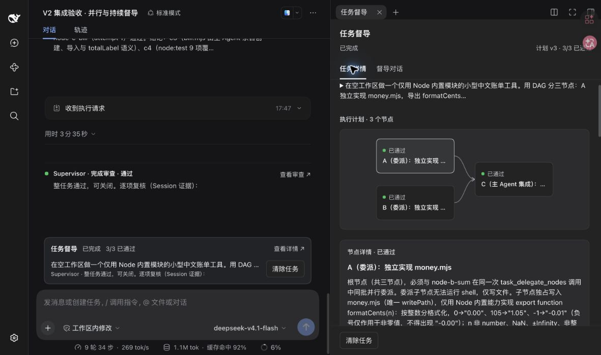
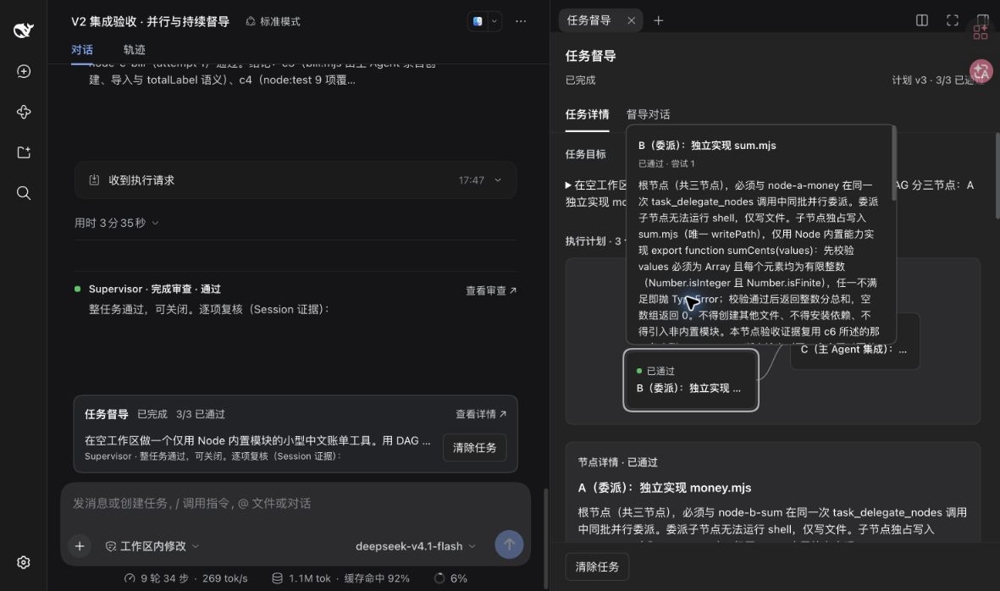
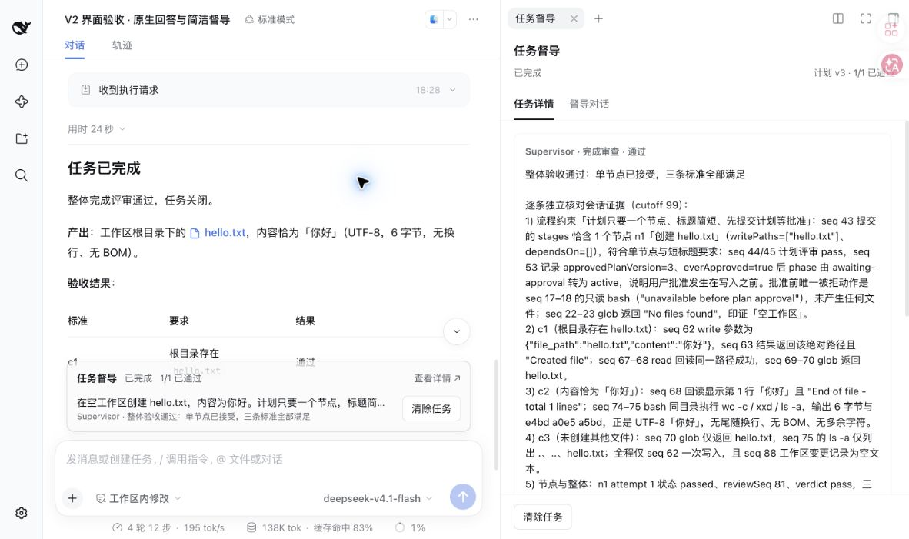
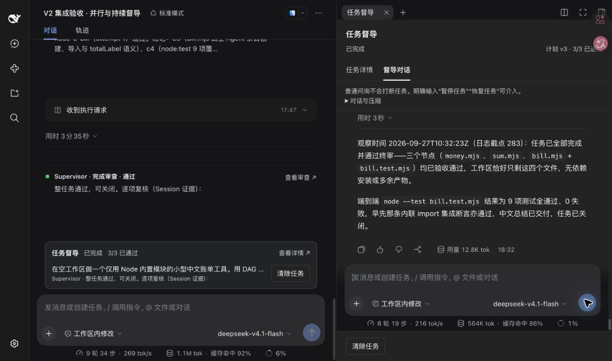

# V2 界面层次与原生回答验收

## 改动与原因

主会话负责阅读主 Agent 的回答与当前进展；右侧负责查看完整任务和持续问询。此次实现替换先前的双卡片和上下堆叠侧栏，保留原生模型回答与唯一任务控制器。

| 用户问题 | 实现 |
| --- | --- |
| DAG 节点拥挤、粗边框抢眼 | 节点缩为 154×68，只显示标题与状态；依赖汇合居中，主题使用 DSH 变量。悬停或键盘聚焦看完整说明和验收，点击固定节点详情。 |
| 滚动后找不到控制按钮 | 侧栏正文单独滚动，操作栏位于固定 flex 底部；主会话摘要中的操作跟随原生输入 dock。 |
| 两份进度、主会话重复全文 | `todo_write` 在未结束受督导任务中被执行器拒绝；主会话仅展示摘要和导航链接。原生清单并非第二个 Plan 调度器。 |
| 任务详情和侧问挤在一起 | 分成“任务详情／督导对话”两个 Tab；保留挂载的原生对话与草稿。 |
| 主回答被包装成卡片，移除后又看不到 | 删除主 Agent 提交卡片。成功检查点后允许一次无工具原生模型回答，再让控制器按原有规则续行。Supervisor 保留独立短摘要。 |

计划标题与审查首行提示要求简短、使用任务语言；完整内容仍保留。节点报告后的自然语言曾提前使用“任务完成”标题，最终控制状态仍需整体审查；已补充提示区分检查点通过与 `phase=complete`。模型措辞不构成完成裁决。

## 自动与真实验证

- 7 个内核文件、55 项检查通过。新增用例验证普通 Session 的 todos 不受影响，以及检查点后的单次原生回答、空工具列表、异常工具请求拒绝和后续用户轮次恢复。
- 宿主和客户端严格类型检查通过；Node 24 在隔离插件副本构建成功。没有重写原用户实例正在服务的插件 lib。
- 复用注册环境 `supervisor-v2`，端口 59909；本次最终 PID 53906，仅作为验收时快照。31973（PID 94963）和日常 3080（PID 11374）保留。模型路由继续使用 CodeBuddy 首个 `deepseek-v4.1-flash`；不声称与日常当前默认模型相同。
- 新案例 `ui-hierarchy` 的工作区由原生 API 绑定 TMP 目录 `dsh-v2-ui-9vvf5s43`，复用相同 Host。Session：`session-20d2e846-e295-4fee-aaa6-89dbe550ca9c`；task：`f9a3800e-c040-4fcf-8a59-040d593e7e2e`。
- 真实任务要求一个节点创建唯一的 `hello.txt`，正文为“你好”，先等批准。重新提交计划后 seq 49 出现原生无工具计划回答；侧栏批准后，节点审查和最终审查后的回答分别为 seq 86、105。最终 phase 为 `complete`、revision 10，主 Agent idle。
- 工作区外检查：目录仅有 `hello.txt`，字节为 `e4bda0e5a5bd`。原生 todos 为 null；原生 plan 的 active/pending 均为 false。

## 浏览器观察

批准按钮在侧栏正文从顶部滚到 `scrollTop=845.2` 后，顶部坐标仍为 `y=655.7`；点击成功触发批准。主会话“查看详情”打开右侧完整任务，“查看审查”打开对应审查且滚到顶部。审查已超出最近 50 条窗口时显示明确提示，不退回到最新审查冒充旧结果。

已有三节点 DAG 案例 `session-f697363e-74f6-4441-8ddc-e1471e5321ac` 显示 A/B → C 与 3/3 已通过。浅色和深色页面均观察到 DSH 主题变量生效；键盘焦点的悬浮信息完整可读，正文可滚动。界面截图如下：

新任务的原生回答直接由 DSH 展示：

持续对话复用原先已压缩的绑定 Session。输入问询草稿后切换到详情再返回，草稿全文保留；发送只读最终进度问询后继续得到中文回答，任务仍为 complete、revision 23。Tab 内保持原生历史、输入框与模型选择。

## 验证边界

历史轮次中没有生成的模型最终回答不会由插件补造。旧 `todo_write` 日志不删除，原生投影按下一轮行为更新。此次真实任务证明检查点回答和交互链可用，不代表正式长程质量评测；新提示中的阶段/整体措辞约束尚未单独重新评分。DAG 与对话使用已有持久案例验证，未重复启动其所有工作。

[English](v2-ui-validation.md)
